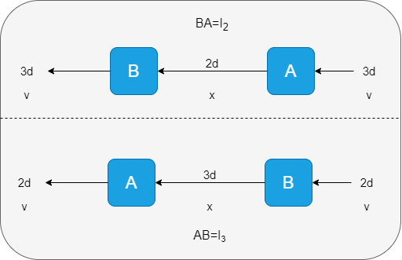
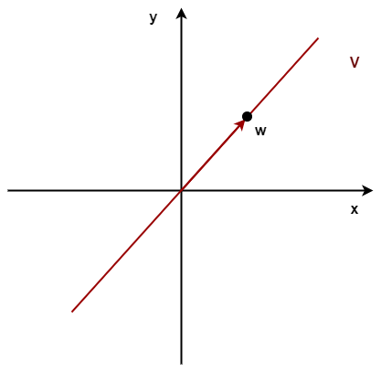
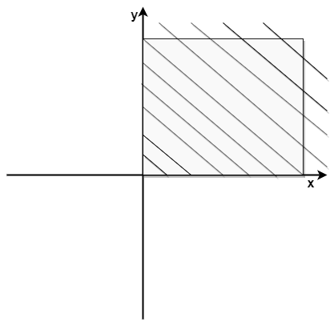
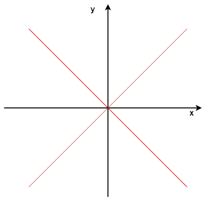

<font align="center" face="黑体" size=15  bold=True> 线性代数笔记 </font>

<p align="right"> ——台大李宏毅线性代数课程笔记 </p>

<!-- TOC -->

- [第一课 线性代数课程简介](#第一课-线性代数课程简介)
  - [1.1 引言](#11-引言)
  - [1.2 线性系统](#12-线性系统)
  - [1.3 课程内容安排](#13-课程内容安排)
  - [1.4 线性系统的应用](#14-线性系统的应用)
- [第二课 线性系统与线性方程组](#第二课-线性系统与线性方程组)
- [第三课 向量](#第三课-向量)
  - [3.1 向量的标量乘法](#31-向量的标量乘法)
  - [3.2 向量加法](#32-向量加法)
  - [3.3 向量集合](#33-向量集合)
  - [3.4 向量的性质](#34-向量的性质)
  - [3.5 向量的更多性质](#35-向量的更多性质)
- [第四课 矩阵](#第四课-矩阵)
  - [4.1 矩阵本质上就是向量的集合](#41-矩阵本质上就是向量的集合)
  - [4.2 矩阵元素的索引](#42-矩阵元素的索引)
  - [4.3 矩阵运算](#43-矩阵运算)
  - [4.4 矩阵的性质](#44-矩阵的性质)
  - [4.5 矩阵的转置](#45-矩阵的转置)
- [第五课 矩阵向量积](#第五课-矩阵向量积)
  - [5.1 从行的角度看矩阵向量积](#51-从行的角度看矩阵向量积)
  - [5.2 从列的角度看矩阵向量积](#52-从列的角度看矩阵向量积)
  - [5.3 矩阵向量积的性质](#53-矩阵向量积的性质)
- [第六课 是否有解](#第六课-是否有解)
  - [6.1 解（Solution）](#61-解solution)
  - [6.2 从线性组合的角度来判断方程组是否有解](#62-从线性组合的角度来判断方程组是否有解)
  - [6.3 从生成空间判断方程组是否有解](#63-从生成空间判断方程组是否有解)
  - [6.4 小结](#64-小结)
- [第七课 有多少个解](#第七课-有多少个解)
  - [7.1 依赖(dependent)与独立(independent)](#71-依赖dependent与独立independent)
    - [定义](#定义)
    - [换个角度看dependent与independent](#换个角度看dependent与independent)
    - [小结](#小结)
  - [7.2 如何判断一个方程组有多少个解](#72-如何判断一个方程组有多少个解)
  - [7.3 秩（rank）与零化度（nullity）](#73-秩rank与零化度nullity)
    - [定义](#定义-1)
  - [7.4 小结](#74-小结)
- [第八课 解线性方程组](#第八课-解线性方程组)
  - [8.1 等价性](#81-等价性)
  - [8.2 增广矩阵（Augmented Matrix）](#82-增广矩阵augmented-matrix)
  - [8.3 简化行阶梯形（Reduced Row Echelon Form）](#83-简化行阶梯形reduced-row-echelon-form)
  - [8.4 高斯消元法](#84-高斯消元法)
  - [8.5 矩阵中的block operation](#85-矩阵中的block-operation)
  - [8.6 小结](#86-小结)
- [第九课 从RREF中能知道什么？](#第九课-从rref中能知道什么)
  - [9.1 RREF v.s. Linear Combination](#91-rref-vs-linear-combination)
    - [列对应定理（Column Correspondence Theorem）](#列对应定理column-correspondence-theorem)
    - [行不对应定理？](#行不对应定理)
    - [Span](#span)
    - [小结](#小结-1)
  - [9.2 RREF v.s. Independent](#92-rref-vs-independent)
    - [从Column Correspondence Theorem出发](#从column-correspondence-theorem出发)
    - [Independent](#independent)
  - [9.3 RREF v.s. Rank](#93-rref-vs-rank)
    - [秩的性质](#秩的性质)
    - [秩与基本变量、自由变量](#秩与基本变量自由变量)
    - [小结](#小结-2)
  - [9.4 RREF v.s. Span](#94-rref-vs-span)
    - [复习](#复习)
- [第十课 矩阵乘法](#第十课-矩阵乘法)
  - [10.1 矩阵乘法的四种方式](#101-矩阵乘法的四种方式)
    - [内积法](#内积法)
    - [Columns的线性组合](#columns的线性组合)
    - [Rows的线性组合](#rows的线性组合)
    - [矩阵相加](#矩阵相加)
  - [10.2 矩阵的区块相乘](#102-矩阵的区块相乘)
  - [10.3 矩阵的一些性质](#103-矩阵的一些性质)
  - [10.4 实际应用](#104-实际应用)
- [第十一课 矩阵的逆](#第十一课-矩阵的逆)
  - [11.1 什么是矩阵的逆](#111-什么是矩阵的逆)
    - [定义](#定义-2)
    - [矩阵的逆的的性质](#矩阵的逆的的性质)
    - [矩阵的逆的应用示例](#矩阵的逆的应用示例)
    - [矩阵的逆的一些性质](#矩阵的逆的一些性质)
  - [11.2 什么样的矩阵是可逆的](#112-什么样的矩阵是可逆的)
    - [复习](#复习-1)
    - [判断矩阵$A$是否可逆](#判断矩阵a是否可逆)
    - [小结](#小结-3)
  - [11.3 初等矩阵的逆](#113-初等矩阵的逆)
    - [什么是初等矩阵](#什么是初等矩阵)
    - [怎么求初等矩阵](#怎么求初等矩阵)
    - [怎么求初等矩阵的逆](#怎么求初等矩阵的逆)
    - [初等矩阵与RREF](#初等矩阵与rref)
  - [11.4 求一般可逆矩阵的逆](#114-求一般可逆矩阵的逆)
    - [Python求矩阵的逆](#python求矩阵的逆)
- [第十二课 子空间](#第十二课-子空间)
  - [0.12.1. 子空间（subspace）定义](#0121-子空间subspace定义)
  - [12.2 Subspace v.s. Span](#122-subspace-vs-span)
  - [12.3 零空间、列空间与行空间](#123-零空间列空间与行空间)
    - [零空间（Null Space）](#零空间null-space)
    - [列空间（Column Space）](#列空间column-space)
    - [行空间（Row Space）](#行空间row-space)
    - [RREF与行列空间](#rref与行列空间)
  - [12.4 小结](#124-小结)
- [第十三课 子空间的基](#第十三课-子空间的基)
  - [13.1 什么是子空间的基](#131-什么是子空间的基)
    - [定义](#定义-3)
    - [列空间的基](#列空间的基)
    - [一些trivial的性质](#一些trivial的性质)
    - [基的相关定理](#基的相关定理)
    - [More from Theorems](#more-from-theorems)
    - [小结](#小结-4)
  - [13.2 判断向量集是不是子空间的基](#132-判断向量集是不是子空间的基)
- [第十四课 行空间、列空间与零空间](#第十四课-行空间列空间与零空间)
  - [14.1 列空间](#141-列空间)
  - [14.2 零空间](#142-零空间)
  - [14.3 行空间](#143-行空间)
  - [14.4 一些性质](#144-一些性质)
  - [14.5 小结](#145-小结)
- [第十五课 坐标系](#第十五课-坐标系)
  - [15.1 坐标系](#151-坐标系)
    - [同一个向量在不同坐标系下的表示](#同一个向量在不同坐标系下的表示)
    - [不同的东西在不同坐标系下的相同表示](#不同的东西在不同坐标系下的相同表示)
    - [什么是坐标系](#什么是坐标系)
  - [15.2 坐标系的变换](#152-坐标系的变换)
    - [向量的变换](#向量的变换)
      - [$Other System \Rightarrow Cartesian$](#other-system-rightarrow-cartesian)
      - [$Cartesian \Rightarrow Other System$](#cartesian-rightarrow-other-system)
      - [小结](#小结-5)
    - [函数的变换](#函数的变换)
  - [15.3 小结](#153-小结)
- [第十六课 坐标系中的线性函数](#第十六课-坐标系中的线性函数)
- [第十七课 行列式](#第十七课-行列式)
  - [17.1 行列式的计算](#171-行列式的计算)
    - [Cofactor Expansion（余子式）](#cofactor-expansion余子式)
  - [17.2 行列式的性质](#172-行列式的性质)
    - [行列式的三个基本性质](#行列式的三个基本性质)
  - [17.3 克莱姆法则（Cramer's Rule）](#173-克莱姆法则cramers-rule)

<!-- /TOC -->

<a id="markdown-第一课-线性代数课程简介" name="第一课-线性代数课程简介"></a>
## 第一课 线性代数课程简介

在线性代数这门课里面，我们将首先讨论什么是线性代数，我们可以学习到什么样的知识，可以解决什么问题。

<a id="markdown-11-引言" name="11-引言"></a>
### 1.1 引言

在开始之前，我们先提一个概念—— **系统（system）** 。系统就是一个可以利用 **输入（input）** 得到 **输出（output）** 的东西，也可以叫做函数（function）、转换（transformation），操作（operator）。

比如：

语音识别系统


对话系统


通信系统


我们在线性代数这门课中，要研究的就是线性的系统。

<a id="markdown-12-线性系统" name="12-线性系统"></a>
### 1.2 线性系统

线性系统是指具备以下两个性质的系统：

1. 保留乘法特性（Persevering Multiplication），即系统的输入增加 *k* 倍，其输出也将增加*k*倍


2. 保留加法特性（Persevering addition），即系统的输入增加$x_{2}$,其输出会对应输出$y_{2}$


例子：判断以下系统是否为现象系统

1. 二次函数系统

 

答：当输入增加为 $kx$ 时，输出为 $k^{2}x^{2}$，不满足性质1；当输入为$x_{1}+x_{2}$，输出为$(x_{1}+x_{2})^{2}$，不满足性质2。故为非线性系统。


2. 微分系统


答：微分是线性系统


3. 定积分系统


答：定积分系统是线性的，详见定积分的线性性质：https://blog.csdn.net/phoenix198425/article/details/78757050

4. 多输入输出系统


答：易证，线性系统。


<a id="markdown-13-课程内容安排" name="13-课程内容安排"></a>
### 1.3 课程内容安排

1-3 章将针对以下线性系统，完成下列问题：

1. 指定该线性系统的输出，问能否找到对应的输入，即该系统（线性方程组）是否有解？
2. 若有解，问是否是唯一解？
3. 如何找到该系统的解？
4. 还将讲到一个重要的性质——行列式。


4 章关于如何将一个复杂的线性系统描述成一个简单的线性系统及相关知识。


5 章关于特征值、特征向量等，我们有的线性系统可以放大某些输入而缩小另一些输入，这些都与特征值、特征向量有关，掌握这些知识，我们就可以设计一些滤波器。


6 章关于向量。

7 章关于当线性系统无解时，如何求得近似解。

<a id="markdown-14-线性系统的应用" name="14-线性系统的应用"></a>
### 1.4 线性系统的应用

在我们的生活中，其实有很多系统都是（或者可以认为是）线性系统，比如

* 电路系统
  


* 通信系统


* 信号处理（傅里叶变换）


* 气象预测


* 计算机图形学


* 搜索引擎


* ……

<a id="markdown-第二课-线性系统与线性方程组" name="第二课-线性系统与线性方程组"></a>
## 第二课 线性系统与线性方程组

在线性代数中，每一个线性系统都可以写成多元一次线性方程组，线性系统=多元一次线性方程组。


线性方程组就是由多个线性方程组成，每个线性方程相应的变量、系数以及常量组成。


高中时候，我们往往解的就是上面那种3元的方程组，在这门课中，我们记线性方程组由$m$个方程组成，每个方程包含$n$个向量，$m$和$n$都可以很大。


我们很容易地将线性方程组写成线性系统的形式，但是给定一个线性系统（黑匣子），我们如何写出对应的线性方程组呢？


具体过程如下所示，我们可以给线性系统输入不同的单位向量，这样我们就得到了对应方程组系数，这样我们就得到了线性方程组。


<a id="markdown-第三课-向量" name="第三课-向量"></a>
## 第三课 向量

向量就是一组数字的集合，有列向量和行向量。在本门课中，如无特别指出则为列向量。


向量中的第$i$个元素记为$v_{i}$，当元素个数小于3时可以可视化，但本门课中研究的往往是更高维的向量。

<a id="markdown-31-向量的标量乘法" name="31-向量的标量乘法"></a>
### 3.1 向量的标量乘法
$$c*v= \begin{bmatrix}
c*v_{1}\\
c*v_{2}    
\end{bmatrix}
$$


<a id="markdown-32-向量加法" name="32-向量加法"></a>
### 3.2 向量加法

$$\begin{bmatrix}
    a_{1}\\
    a_{2}
\end{bmatrix} + 
\begin{bmatrix}
 b_{1}\\
 b_{2}   
\end{bmatrix} = 
\begin{bmatrix}
    a_{1}+b_{1}\\
    a_{2}+b_{2}
\end{bmatrix}$$


<a id="markdown-33-向量集合" name="33-向量集合"></a>
### 3.3 向量集合

1. 一个包含4个元素的向量集合
   


2. 一个包含无数元素的向量集合


我们记所有$n$维向量的集合为$R^{n}$，如二维向量记为$R^{2}$。


<a id="markdown-34-向量的性质" name="34-向量的性质"></a>
### 3.4 向量的性质

准确来说是具有以下8个性质的东西称之为向量，而不是向量具有以下8个性质。

对于任意向量$u$，$v$和$w$，任意标量$a$和$b$，有

1. $u+v = v+u$
2. $(u+v)+w = u+(v+w)$
3. 存在零向量 $0$，使得 $0+u = u$
4. 存在逆向量 $u^{`}$，使得 $u^{`}+u = 0$
5. $1u = u$
6. $(ab)u = a(bu)$
7. $a(u+v) = au+av$
8. $(a+b)u = au +bu$
   
<a id="markdown-35-向量的更多性质" name="35-向量的更多性质"></a>
### 3.5 向量的更多性质
  
对于任意$n$维向量$u$,$v$和$w$以及标量$a$，有

1. 如果$u+v = w+v$， 则有$u=w$
2. 如果$u+v = w+u$， 则有$v=w$
3. $R^{n}$中有且只有一个零向量$0$，使得$0+u = u$
4. $R^{n}$中的每一个向量都存在逆向量 $u^{`}$，使得 $u^{`}+u = 0$
5. $0u=0$
6. $a0=0$
7. $u^{`} = -1(u) = -u$
8. $(-a)u = a(-u) = -(au)$

<a id="markdown-第四课-矩阵" name="第四课-矩阵"></a>
## 第四课 矩阵

<a id="markdown-41-矩阵本质上就是向量的集合" name="41-矩阵本质上就是向量的集合"></a>
### 4.1 矩阵本质上就是向量的集合


如果一个矩阵具有$m$行和$n$列，我们说该矩阵的大小为$m$ x $n$。 如果$m=n$，则该矩阵称为方阵。所有大小为$m$ x $n$的矩阵表示为$M_{m*n}$.

<a id="markdown-42-矩阵元素的索引" name="42-矩阵元素的索引"></a>
### 4.2 矩阵元素的索引

我们称矩阵$A$中第$i$行第$j$列的元素为$a_{ij}$

$$
A = \begin{bmatrix}
    a_{11} &\cdots &a_{1n} \\
    \vdots &\ddots &\vdots \\
    a_{m1} &\cdots &a_{mn}
\end{bmatrix}
A = \begin{bmatrix}
    2 &3 &5\\
    3 &1 &-1\\
    -2 &1 &1
\end{bmatrix}
$$
例：$a_{11}=2, a_{33}=1$     

<a id="markdown-43-矩阵运算" name="43-矩阵运算"></a>
### 4.3 矩阵运算

$$
A=\begin{bmatrix}
  1 &4\\
  2 &5\\
  3 &6  
\end{bmatrix}
B = \begin{bmatrix}
   6 &9\\
   8 &0\\
   9 &2 
\end{bmatrix}
$$

具有相同尺寸的矩阵才能相加或相减 
$$
A+B = \begin{bmatrix}
    7 &13\\
    10 &5\\
    12 &8
\end{bmatrix}

A-B=\begin{bmatrix}
    -5 &-5\\
    -6 &5\\
    -6 &4
\end{bmatrix}
$$

矩阵可以与标量相乘

$$
9B = \begin{bmatrix}
    54 &81\\
    72 &0\\
    81 &18
\end{bmatrix}
$$

* 0矩阵是指所有元素都为0的矩阵

$$0_{2*3} = \begin{bmatrix}
    0 &0 &0\\
    0 &0 &0
\end{bmatrix}$$

* 单位矩阵是指除了对角线上的元素为1，其它元素都为0的矩阵

$$
I_{3} = \begin{bmatrix}
    1 &0 &0\\
    0 &1 &0\\
    0 &0 &1
\end{bmatrix}
$$

<a id="markdown-44-矩阵的性质" name="44-矩阵的性质"></a>
### 4.4 矩阵的性质

设$A,B,C$为$m$X$n$的矩阵，$s,t$为常数，则有

1. $A+B=B+A$
2. $(A+B)+C=A+(B+C)$
3. $(st)A=s(tA)$
4. $s(A+B)=sA+sB$
5. $(s+t)A=sA+tA$

<a id="markdown-45-矩阵的转置" name="45-矩阵的转置"></a>
### 4.5 矩阵的转置

若$A$是一个$m$X$n$的矩阵，则$A^{T}$是一个$n$X$m$的矩阵，其中第$(i,j)$个元素为矩阵$A$中第$(j,i)$个元素，可以直观理解为将矩阵$A$沿着左上到右下的对角线为轴进行翻转。

$$
A=\begin{bmatrix}
    6 &9\\
    8 &0\\
    9 &2
\end{bmatrix}

A^{T}=\begin{bmatrix}
    6 &8 &9\\
    9 &0 &2
\end{bmatrix}
$$

设设$A,B$为$m$X$n$的矩阵，$s$为常数，则有

1. $(A^{T})^{T}=A$
2. $(sA)^{T}=sA^{T}$
3. $(A+B)^{T}=A^{T}+B^{T}$

<a id="markdown-第五课-矩阵向量积" name="第五课-矩阵向量积"></a>
## 第五课 矩阵向量积

前面我们简单了解了线性系统，也复习了线性方程组、向量、矩阵等知识，现在我们把这些知识给串起来。

如下图所示，在线性系统中，一个$x$向量输入到系统中，最终输入向量$b$，实际上我们一般是已知系统的输出求输入。这样的一个线性系统可以用下面的多元一次联立方程组表示，我们可以进一步把方程组的系数提取出来组成一个矩阵，未知变量组成一个向量，输出组成一个向量，那么就可以表示成矩阵向量乘积的形式$Ax=b$。


<a id="markdown-51-从行的角度看矩阵向量积" name="51-从行的角度看矩阵向量积"></a>
### 5.1 从行的角度看矩阵向量积

从行的角度来看，矩阵向量积实际上是拿矩阵$A$的每一行和向量$x$做内积，如下图所示。


<a id="markdown-52-从列的角度看矩阵向量积" name="52-从列的角度看矩阵向量积"></a>
### 5.2 从列的角度看矩阵向量积

从列的角度来看，矩阵向量积是矩阵中列向量的线性组合（linear combination），向量$x$就是组合系数，如下图所示。


* 示例

总而言之，矩阵向量积从行的角度来看是做内积，而从列角度来看是做线性组合。


*注：矩阵与向量相乘，其维度必须匹配，即矩阵的列数必须等于向量的长度*

<a id="markdown-53-矩阵向量积的性质" name="53-矩阵向量积的性质"></a>
### 5.3 矩阵向量积的性质

设$A,B$为$m$x$n$的矩阵，$u,v$是$R^{n}$中的向量，$c$是一个常量，则有

1. $A(u+v)=Au+Av$
2. $A(cu)=c(Au)=(cA)u$
3. $(A+B)u=Au+Bu$
4. ......

<a id="markdown-第六课-是否有解" name="第六课-是否有解"></a>
## 第六课 是否有解

接下来，进入线性代数这门课的正题，即判断$Ax=b$是否有解。


前面讲到线性系统可以表示成多元一次联立方程组，而方程组可以写成矩阵向量积的形式$Ax=b$。对于给定的系数矩阵$A$和向量$b$，$x$有时存在（称之为有解），有时不存在（称之为无解）。本节课的目标就是判断$Ax=b$是否有解。

<a id="markdown-61-解solution" name="61-解solution"></a>
### 6.1 解（Solution）

给定如下线性方程组，$\begin{bmatrix}
   2\\
   5\\
   1 
\end{bmatrix}$是该方程组的一个解，$\begin{bmatrix}
    -4\\
    3\\
    7
\end{bmatrix}$是另外的一个解，该方程组还存在很多其它可能的解。我们把一个线性方程组的所有解的集合称为该方程组的解集。


如果一个线性方程组有一个或多个解，则称这个方程组是Consistent的；反之，如果这个方程组的解集是空集，那么称这个方程组是inconsistent。


在高中阶段，我们解的线性方程组往往是二元一次方程组，我们可以根据方程组在坐标系上把这两天直线画出来，如果两条直线相交则有一个解，如果平行则无解，如果重合则有无穷解。

示例：


现在我们研究的不只是二元的线性方程组，无法在坐标系中画出对应的直线，那么我们该怎么判断多元一次方程组是否有解呢？这节课我们就介绍两种方法（或者说从两个角度）判断方程组是否有解，分别是线性组合（linear combination）以及生成空间（span）。

<a id="markdown-62-从线性组合的角度来判断方程组是否有解" name="62-从线性组合的角度来判断方程组是否有解"></a>
### 6.2 从线性组合的角度来判断方程组是否有解

线性组合

给定一个向量集合$\{u_{1},u_{2},...,u_{k}\}$，该向量集合的线性组合$v=c_{1}u_{1}+c_{2}u_{2}+...+c_{k}u_{k}$，其中$c_{1},c_{2},...,c_{k}$为标量常数，即线性组合的系数。

示例：向量集合为$u=\begin{Bmatrix}
    \begin{bmatrix}
    1\\
    1
    \end{bmatrix},
        \begin{bmatrix}
    1\\
    3
    \end{bmatrix},
        \begin{bmatrix}
    1\\
    -1
    \end{bmatrix}
\end{Bmatrix}$，系数向量为$c=\{-3,4,1\}$，其线性组合为？

$$
v=cu=\begin{Bmatrix}
    \begin{bmatrix}
    1\\
    1
    \end{bmatrix}*-3,
        \begin{bmatrix}
    1\\
    3
    \end{bmatrix}*4,
        \begin{bmatrix}
    1\\
    -1
    \end{bmatrix}*1
\end{Bmatrix}=\begin{bmatrix}
    2\\
    8
\end{bmatrix}
$$

线性组合即为列角度（Column Aspect）的矩阵向量积


从这个角度来看，方程组$Ax=b$是否有解、这个方程组是否是consistent、方程组的解集是否为空等价于向量$b$是否是矩阵$A$的列（column）的线性组合，因此我们可以从这个角度来判断方程组是否有解。


示例1：


将向量$b$以及矩阵$A$的列向量都画在坐标系上，我们可以看到矩阵$A$的列向量$\begin{Bmatrix}
    \begin{bmatrix}
    3\\2
    \end{bmatrix}
        \begin{bmatrix}
    6\\4
    \end{bmatrix}
\end{Bmatrix}$在同一条直线，但是向量$b=\begin{bmatrix}
    3\\4
\end{bmatrix}$不在这条线上，因此向量$b$不是矩阵$A$的列向量的线性组合，该方程组没有解。


示例2：


从图中可以看到$\begin{bmatrix}
    4\\-1
\end{bmatrix}=-1*\begin{bmatrix}
2\\3
\end{bmatrix}+2\begin{bmatrix}
3\\1
\end{bmatrix}$，向量$b$是矩阵$A$的列向量线性组合，该方程组有解。从本质上看，在二维平面内，存在两个不平行的非零向量，这个平面内的所有其他向量都是这两个向量的线性组合。但是在三维空间中这个结论不成立，三个不平行的非零向量不一定构成三位空间（比如三个向量在同一个平面），实际上三个独立（independent）的向量才能构成三维空间，关于independent的概念以后再说。


示例3：


同样，由图可知该方程组有解。


<a id="markdown-63-从生成空间判断方程组是否有解" name="63-从生成空间判断方程组是否有解"></a>
### 6.3 从生成空间判断方程组是否有解

生成空间（span）定义：

有向量集合$S=\{u_{1},u_{2},...,u_{k}\}$，生成空间是指$u_{1},u_{2},...,u_{k}$所有线性组合构成的向量集合，记为$Span\{u_{1},u_{2},...,u_{k}\}$或$Span\ S$

$$Span S = \{c_{1}u_{1}+c_{2}u_{2}+...+c_{k}u_{k}| for\ all\ c_{1},c_{2},...,c_{k}\}$$

示例：

1. 设$S_{0}=\begin{Bmatrix}
    \begin{bmatrix}
    0\\0
    \end{bmatrix}
\end{Bmatrix}$，则$Span\ S_{0}$？

答：$Span\ S_{0}=\begin{Bmatrix}
    \begin{bmatrix}
    0\\0
    \end{bmatrix}
\end{Bmatrix}$，零向量的任意线性组合都是零向量。

2. 设$S_{1}=\begin{Bmatrix}
    \begin{bmatrix}
    1\\-1
    \end{bmatrix}
\end{Bmatrix}$，则$Span\ S_{1}$？

答：


如果$S$包含非零向量，则$Span\ S$包含无数向量。

3. 设$S_{2}=\begin{Bmatrix}
    \begin{bmatrix}
    1\\-1
    \end{bmatrix}，
        \begin{bmatrix}
    -2\\2
    \end{bmatrix}
\end{Bmatrix}$，则$Span\ S_{2}$？

答：


4. 设$S_{3}=\begin{Bmatrix}
    \begin{bmatrix}
    1\\-1
    \end{bmatrix}，
    \begin{bmatrix}
    -2\\2
    \end{bmatrix}，
    \begin{bmatrix}
    2\\1
    \end{bmatrix}
\end{Bmatrix}$，则$Span\ S_{3}$？

答：$Span\ S_{3}=R^{2}$


再一个例子

三维空间


那么从这个角度来讲，判断一个方程组$Ax=b$是否有解就等价于$b$是否在矩阵$A$的列向量的生成空间中。


<a id="markdown-64-小结" name="64-小结"></a>
### 6.4 小结

至此，对于方程组$Ax=b$，我们可以从两个角度来判断它是否有解，其一：判断向量$b$是否是矩阵$A$的列向量的线性组合；其二：判断向量$b$是否在矩阵$A$的列向量的生成空间中，如果是，则方程组有解。


<a id="markdown-第七课-有多少个解" name="第七课-有多少个解"></a>
## 第七课 有多少个解

前面我们已经讲过对于一个具有$m$个方程、$n$个变量的方程组$Ax=b \ A:m*n \ x\in R^{n} \ b \in R^{m}$，可以通过判断向量$b$是否是矩阵$A$的列向量的线性组合或判断向量$b$是否在矩阵$A$的列向量的生成空间中来确定该方程组是否有解，那么这节课我们将来讲讲如果方程组有解该怎么判断它有多少个解。


先上结论，在方程组有解的前提下，如果矩阵$A$的列向量是独立的（independent）或它的秩（rank）等于$n$或它的零化度（nullity）等于$0$，那么该方程组仅有唯一解，反之（矩阵$A$的列向量是依赖的（dependent）或它的秩（rank）小于$n$或它的零化度（nullity）大于$0$）有无穷解。


*注：方程组只会出现唯一解或无穷解这两种情况，不会出现只有两个解、三个解的情况。如果我们能够为方程组找到一个解$x$和另一个解$x^{`}$，那么就可以通过$0.4x+0.6x^{`}、0.3x+0.7x^{`}、……$这样的方式找到无穷解*

<a id="markdown-71-依赖dependent与独立independent" name="71-依赖dependent与独立independent"></a>
### 7.1 依赖(dependent)与独立(independent)

#### 定义

对于方程组$Ax=b$的系数矩阵$A=\{a_{1},a_{2},...,a_{n}\}$，如果能够找到一组不全为零的标量常数$x_{1},x_{2},...,x_{n}$，使得$x_{1}a_{1}+x_{2}a_{2}+...+x_{n}a_{n}=0$，那么就可以说这一组向量$a_{1},a_{2},...,a_{n}$是dependent的。如果我们可以找到这样一组满足要求的标量常数，那么就可以轻易得到其他很多组常数。反之，如果唯有$x_{1}=x_{2}=...=x_{n}=0$才能使得$x_{1}a_{1}+x_{2}a_{2}+...+x_{n}a_{n}=0$，那么向量$a_{1},a_{2},...,a_{n}$就是independent的。


#### 换个角度看dependent与independent

给定一个向量集合，$\{a_{1},a_{2},...,a_{n}\}$，如果其中存在任意$a_{i}$是其他向量的线性组合，那么这个向量集合就是linear dependent的。

示例：

$\begin{Bmatrix}
    \begin{bmatrix}
        -4\\12\\6
    \end{bmatrix}
        \begin{bmatrix}
        -10\\30\\15
    \end{bmatrix}
\end{Bmatrix}$，其中$a_{1}=\frac{2}{5}a_{2}$，因此该向量集合是dependent的

$\begin{Bmatrix}
    \begin{bmatrix}
        6\\3\\3
    \end{bmatrix}
        \begin{bmatrix}
        1\\8\\3
    \end{bmatrix}
    \begin{bmatrix}
        7\\11\\6
    \end{bmatrix}
\end{Bmatrix}$，其中$a_{3}=a_{1}+a_{2}$，因此该向量集合也是dependent的

$\begin{Bmatrix}
    \begin{bmatrix}
        6\\-1\\7
    \end{bmatrix}
        \begin{bmatrix}
        0\\0\\0
    \end{bmatrix}
    \begin{bmatrix}
        -2\\5\\1
    \end{bmatrix}
\end{Bmatrix}$，其中$a_{2}=0*a_{1}+0*a_{3}$,这样也完全符合线性组合的定义的，因此这个向量集合也是dependent的

*注：1. 零向量是任何其他向量的线性组合*

*2.任何包含零向量的集合都是linear dependent的*

*2.当集合只有一个向量时，$a_{i}=x_{1}a_{1}+x_{2}a_{2}+...+x_{n}a_{n}$不存在定义，因此判断是否是dependent需要回归最初的定义：存在不全为0的系数使得$x_{1}a_{1}+x_{2}a_{2}+...+x_{n}a_{n}=0$。例如：单独的零向量就满足这一个定义，因此它是linear dependent的*

#### 小结

“给定一个向量集合，$\{a_{1},a_{2},...,a_{n}\}$，如果其中存在任意$a_{i}$是其他向量的线性组合，那么这个向量集合就是linear dependent的”等价于“给定一个向量集合，$\{a_{1},a_{2},...,a_{n}\}$，存在不全为零的标量常数$x_{1},x_{2},...,x_{n}$使得$x_{1}a_{1}+x_{2}a_{2}+...+x_{n}a_{n}=0$，那么这个向量集合就是linear dependent的”。


<a id="markdown-72-如何判断一个方程组有多少个解" name="72-如何判断一个方程组有多少个解"></a>
### 7.2 如何判断一个方程组有多少个解

如果存在一个系数矩阵列向量是dependent的线性方程组$Ax=b$，一旦它有解，那么它将有无穷多个解。这就是dependent与解的个数的关系。


*注意：并不是dependent的就一定有解*

* 直观的解释：

如下方程组，系数矩阵中$a_{1}+a_{2}=a_{3}$,并且找到一个解$x=\begin{bmatrix}
    1\\1\\1
\end{bmatrix}$,根据dependent的性质，$a_{3}$可以用$a_{1}+a_{2}$代替，那么我们解可以找到第二个解$x=\begin{bmatrix}
    2\\2\\0
\end{bmatrix}$，然后我们就可以利用这两个解构成无穷多个解。


* 证明：

$A$的列向量是dependent的，我们可以得到结论：如果$Ax=b$有解，则有无穷解。反过来说，如果$Ax=b$有无穷解，那么$A$的列向量是dependent的。


在开始证明之前，我们引入一个新的概念

* 齐次线性方程式

$$Ax=0\ A=[a_{1},a_{2},...,a_{n}]\ x=\begin{bmatrix}
    x_{1}\\x_{2}\\\vdots \\x_{n}
\end{bmatrix}$$

我们称这样常数项为零向量的线性方程为齐次线性方程式（Homogeneous linear equations），这样的方程组最起码有一个零向量作为它的解。

根据定义，如果系数矩阵$A$的列向量是线性依赖（linear dependent）的，那么$Ax=0$就会有无数个非零解。如果系数矩阵$A$的列向量是线性独立（linear independent）的，那么$Ax=0$只会有一个解，且为零解。这些是可以通过定义直接得出来的。


* 证明过程

证明“$A$的列向量是dependent的，我们可以得到结论：如果$Ax=b$有解，则有无穷解”：

根据Homogeneous linear equations中dependent的性质，我们可以找到一个非零解$u$使得$Au=0$；同时如果$Ax=b$有解表示存在一个解$v$使得$Av=b$。加起来，$A(u+v)=b$，因此$u+v$是$Ax=b$的另一个解。前面说到如果一个方程组可以找到两个不同的解，那么它就业无穷多个解。证明结束。

证明“如果$Ax=b$有无穷解，那么$A$的列向量是dependent的”：

因为$Ax=b$有无穷解，所以我们找两个不同的解$u$和$v$，根据线性系统保留加法特性的性质得到$A(u-v)=0$，因为$u$和$v$不同，所以$(u-v)$非零。存在非零系数使得矩阵列向量的线性组合等于零向量，那么这个矩阵的列向量就是dependent的。证明结束。


<a id="markdown-73-秩rank与零化度nullity" name="73-秩rank与零化度nullity"></a>
### 7.3 秩（rank）与零化度（nullity）

#### 定义

矩阵的秩是指矩阵中线性独立列的最大数量，零化度则等于列的数量减去矩阵的秩。

$\begin{bmatrix}
    -3 &2 &-1\\
    7 &9 &0\\
    0 &0 &2
\end{bmatrix}$的秩为3、零化度为0，
$\begin{bmatrix}
    1 &3 &10\\
    2 &6 &20\\
    3 &9 &30
\end{bmatrix}$的秩为2、零化度为1，
$\begin{bmatrix}
    0 &0 &0\\
    0 &0 &0\\
    0 &0 &0
\end{bmatrix}$的秩为1、零化度为2。

根据秩的定义，如果一个$m$x$n$矩阵$A$，如果它的秩$Rank\ A=n$、零化度$Nullity\ A=0$，那么$A$的列是新型独立的。


<a id="markdown-74-小结" name="74-小结"></a>
### 7.4 小结

方程组$Ax=b \ A:m*n \ x\in R^{n} \ b \in R^{m}$，可以通过判断向量$b$是否是矩阵$A$的列向量的线性组合或判断向量$b$是否在矩阵$A$的列向量的生成空间中来确定该方程组是否有解。

在方程组有解的前提下，如果矩阵$A$的列向量是独立的（independent）或它的秩（rank）等于$n$或它的零化度（nullity）等于$0$，那么该方程组仅有唯一解，反之（矩阵$A$的列向量是依赖的（dependent）或它的秩（rank）小于$n$或它的零化度（nullity）大于$0$）有无穷解。


或者，我们也可以反过来看


<a id="markdown-第八课-解线性方程组" name="第八课-解线性方程组"></a>
## 第八课 解线性方程组

高中的时候我们已经学过利用消元法去解线性方程组。我们的祖先在很久以前就已经研究过方程组的解法，比如《九章算术》以及《算法统宗》中就有相关记载。


<a id="markdown-81-等价性" name="81-等价性"></a>
### 8.1 等价性

在解方程组之前，我们先来明确一个概念。

如果两个方程组具有相同的解集，那么它们是等价的。


根据上述等价性的定义，我们可以得出对一个线性方程组进行行交换（interchange）、缩放（scaling）和行相加（row addition）可以得到另一个等价的简单方程组。


对方程组进行这三个操作不会改变它的本质，因此这三个操作也就是我们解方程组的基础，高斯消元法解方程组就是通过交替应用这三个操作将方程组化到最简，知道能够一眼就看出方程组的解。

例如：


该方程组可以先将式1乘上-3在加到式2上达到简化式2的目的。此时，我们可以直接得出$x_{2}$等于1，再将$x_{2}$代入到式1中直接接触$x_{1}$等于3。

这就是我们在高中时候解决方程组的方式。接下来，我们将从矩阵向量的角度来看怎么解线性方程组。

<a id="markdown-82-增广矩阵augmented-matrix" name="82-增广矩阵augmented-matrix"></a>
### 8.2 增广矩阵（Augmented Matrix）

我们知道线性方程组可以改写成$Ax=b$的形式，$A$是方程组系数构成的系数矩阵，$x$是输入的未知数向量，$b$是输出的常数向量


我们将系数矩阵$A$和常量向量$b$组合在一起就是我们的增广矩阵


有了增广矩阵的定义，我们就可以把前面讲到高中解方程组的方法换一种表达方式


先将系数和常数提出来组成增广矩阵，然后对增广矩阵做一系列操作得到一个最简单的矩阵，从这个矩阵中我们可以轻易得出我们的解。

在增广矩阵中，上述的操作行交换（interchange）、缩放（scaling）和行相加（row addition）可以换一种方式表达：

1. 交换矩阵中的任意两行(Interchange any two rows of the matrix)
2. 对某些行中的所有元素乘上同一个非零常数(Multiply every entry of some row by the same nonzero scalar)
3. 将矩阵中某行乘上某个非零常数再加到某一行上(Add a multiple of one row of the matrix to another row)

我们将这些操作称为elementary row operations。通过这些操作，我们可以将一个复杂的线性方程组转换称一个简单的线性方程组


增广矩阵经过elementary row operations得到的最简单的矩阵称之为简化行阶梯形矩阵（reduced row echelon form），当一个线性方程组的增广矩阵是简化行阶梯形矩阵时可以轻易得出该方程组的解。

<a id="markdown-83-简化行阶梯形reduced-row-echelon-form" name="83-简化行阶梯形reduced-row-echelon-form"></a>
### 8.3 简化行阶梯形（Reduced Row Echelon Form）

前面说增广矩阵简化到最简单的形式就是简化行阶梯形矩阵，那么怎样才算最简单的形式呢？

1. 该矩阵的所有非零行都在所有的零行上
2. 矩阵的所有leading entries符合阶梯形状

我们称满足上述两个条件的矩阵称为行阶梯形矩阵（Row Echelon Form），如：


当矩阵满足第三个条件：矩阵中包含leading entries的列向量为标准向量时，就是我们的简化行阶梯形矩阵（Reduced Row Echelon Form——RREF），如：


增广矩阵经过一系列不同的行操作可以得到不同的行阶梯形矩阵，但是化简到最后的简化行阶梯形矩阵却是相同的，也就是说简化行阶梯形矩阵是唯一的。


在简化行阶梯形矩阵还有一个重要概念叫中枢（Pivot），leading entries所在的位置称为中枢位置（pivot positions），leading entries所在的列称为中枢列（pivot columns）。例如：矩阵$A$经过简化后得到简化行阶梯形矩阵$R$，我们先找出leading entries，那么$A$对应的位置就是中枢位置，对应的列就是中枢列。例如$A$的中枢位置是$(1,1),(2,3),(3,4)$，而$A$的中枢列为第1、第3、第4列。（后面将改回Pivot的说法）


我们知道从RREF中可以轻易得出方程组的解，下面将详细介绍：

1. 唯一解

当RREF是$[I\ b^{`}]$是形式时，方程组具有唯一解：


我们将增广矩阵重新写成线性方程组的形式，这样我们直接得到了方程组的解。

2. 无穷解


同样，我们先将增广矩阵改写成线性方程组的形式，从而得到：

$$
\begin{aligned}
x_{1}=& 7+3x_{2}-2x_{4}\\
x_{2}=& x_{2}\\
x_{3}=&9-6x_{4}\\
x_{4}=&x_{4}\\
x_{5}=&2
\end{aligned}
$$

其中$x_{2},x_{4}$称为自由变量（free variables），$x_{1},x_{3},x_{5}$称为基本变量（basic variables），free variables可以代入任何的值，通过代入不同的值，我们可以得到不同的解，因此带有free variables的线性方程组将有无穷解。

一般来说，我们会将有无穷解的方程组的解集写成Parametric Representation，如上述方程组的解为：


3. 无解

什么时候会出现无解的情况呢？当RREF矩阵中出现有只有最后一列非零的行的时候无解。


当某一行只有最后一个元素非零时，也就是出现$0x_{1}+0x_{2}+...+0x_{n}=nonzero$，这样的情况是不存在的，因此方程组无解（inconsistent）。

<a id="markdown-84-高斯消元法" name="84-高斯消元法"></a>
### 8.4 高斯消元法

前面介绍了如何从一个方程组的原始增广矩阵经过一系列操作得到简化行阶梯形矩阵（RREF），进而得到方程组的解。实际上这就是高斯消元法，一种寻找矩阵的简化行阶梯形（RREF）的算法。


示例：

有方程组：


构建增广矩阵，将矩阵的第$1$行乘$1$加到第$2$行上、第$1$行乘$-2$加到第$3$行上、第$1$行乘$3$加到第$4$行上


交换第$2$、$3$行


第$2$行乘$-1$加到第$4$行


第$3$行乘$-2$加到第$4$行


第$3$行除以$4$，第$3$行乘$2$加到第$2$行，第$3$行乘$-2$加到第$1$行


第$2$行除以$-1$，第$2$行加到第$1$行，至此，我们求得了RREF


从RREF中求解


写回方程组的形式，$x_{2},x_{5}$为$free\ variables$


写成parametric presentation


如果我们给$free\ variables$代入值就可以求得其中一个解


现代计算机这么发达，我们当然是利用程序来直接求RREF啊！例如用python求RREF：

示例

```python
# import sympy  
from sympy import * 
  
M = Matrix([[1, 0, 1, 3], [2, 3, 4, 7], [-1, -3, -3, -4]]) 
print("Matrix : {} ".format(M)) 
   
# Use sympy.rref() method  
M_rref = M.rref()   
      
print("The Row echelon form of matrix M and the pivot columns : {}".format(M_rref))   
```
输出

```python

Matrix : Matrix([[1, 0, 1, 3], [2, 3, 4, 7], [-1, -3, -3, -4]]) 
The Row echelon form of matrix M and the pivot columns : (Matrix([
[1, 0,   1,   3],
[0, 1, 2/3, 1/3],
[0, 0,   0,   0]]), (0, 1))

```


<a id="markdown-85-矩阵中的block-operation" name="85-矩阵中的block-operation"></a>
### 8.5 矩阵中的block operation

求下面矩阵的RREF


经过观察，我们可以设$R=\begin{bmatrix}
    1 &0 &-3 &0\\
    0 &1 &2 &0\\
    0 &0 &0 &1\\
    0 &0 &0 &0
\end{bmatrix}$， 那么原矩阵可以看作$\begin{bmatrix}
    R\\2R
\end{bmatrix}$，求解


轻易得出RREF为


one more example


<a id="markdown-86-小结" name="86-小结"></a>
### 8.6 小结

我们可以从判断向量集$S=\begin{Bmatrix}
    \begin{bmatrix}
    1\\2\\1
    \end{bmatrix},
    \begin{bmatrix}
    1\\0\\1
    \end{bmatrix},
    \begin{bmatrix}
    1\\4\\1
    \end{bmatrix},
    \begin{bmatrix}
    1\\2\\3
    \end{bmatrix}
\end{Bmatrix}$是否为线性独立这一问题将目前的知识串联起来。

$n$个向量的集合$\{a_{1},a_{2},...,a_{n}\}$线性依赖等价于存在任意向量$a_{i}$是其他向量的线性组合，也等价于存在一组不全为零的常数$x_{1},x_{2},...,x_{n}$使得$x_{1}a_{1}+x_{2}a_{2}+...+x_{n}a_{n}=0$，把$\{a_{1},a_{2},...,a_{n}\}$看作矩阵$A$，$x_{1},x_{2},...,x_{n}$看作向量$x$，那么上述说法也就等价于$Ax=0$存在非零解。


求解RREF


根据RREF求解


写成parametric presentation


设$x_{3}=1$


因此，$Ax=0$存在非零解，$\{a_{1},a_{2},...,a_{n}\}$线性依赖。

<a id="markdown-第九课-从rref中能知道什么" name="第九课-从rref中能知道什么"></a>
## 第九课 从RREF中能知道什么？

<a id="markdown-91-rref-vs-linear-combination" name="91-rref-vs-linear-combination"></a>
### 9.1 RREF v.s. Linear Combination

#### 列对应定理（Column Correspondence Theorem）


原始矩阵与RREF的列向量之间存在对应关系，如果矩阵$A$中存在列向量$a_{j}$是其他列向量的线性组合，如$a_{5}=-a_{1}+a_{4}$，那么在$R$中$r_{j}$也是对应的列向量的线性组合$r_{5}=-r_{1}+r_{4}$。反过来，如果$r_{j}$是$R$中其他列向量的线性组合，如$r_{3}=3r_{1}-2r_{2}$，那么在$A$中$a_{j}$也是对应的列向量的线性组合$a_{3}=3a_{1}-2a_{2}$。

* 示例


* 直观理解


我们对矩阵进行了行交换（B：第1行和第3行交换）、缩放（C:第1行乘2）、行相加（第1行乘-1加到第3行）三种操作，我们可以直观看到列向量之间的关系依然存在。列对应定理可以看作的列之间的承诺：就算行操作让列变得不同，但是它们之间的关系永远不变。


* 推理


矩阵$A$的RREF是$R$，因此$Ax=b$和$Rx=b$不会有相同的解集。增广矩阵$\begin{bmatrix}
    A &b
\end{bmatrix}$的RREF为$\begin{bmatrix}
    R &b^{'}
\end{bmatrix}$，因此$Ax=b$和$Rx=b^{'}$具有相同的解集。如果$b=0$那么经过row elementary operation得到的$\ b^{'}$也为$0$，因此$Ax=0$和$Rx=0$具有相同的解集。

有了以上认识，我们尝试推断列对应定理。设$A,R$矩阵如下所示。


可以看到在矩阵$A$中，$a_{2}=2a_{1}$也就是$-2a_{1}+a_{2}=0$，因此$Ax=0$有一个解为$\begin{bmatrix}
    -2\\1\\0\\0\\0\\0
\end{bmatrix}$，因为$R$是$A$的RREF，因此$Ax=0$和$Rx=0$具有相同的解集，即$Rx=0$也有一个解为$\begin{bmatrix}
    -2\\1\\0\\0\\0\\0
\end{bmatrix}$。因此可以得到$-2r_{1}+r_{2}=0$，也就是$r_{2}=2r_{1}$。反之同理。这就是我们的列对应定理推理过程。


其他列也一样，


前面讨论了column correspondence theorem，那么矩阵的row有没有对应的correspondence theorem呢？

答案是没有的。举个例子，矩阵$A$及其对应RREF如下所示，

#### 行不对应定理？


直观来看在RREF矩阵中，第$4$行是零向量，其他任意一行乘以0都会得到第$4$行，但是在矩阵$A$中却不存在这样的关系。

#### Span

那么矩阵$A$及RREF$R$的生成空间（span）是什么情况呢？向量集合的Span是指这些向量的所有线性组合

先来看一下rows的span，对矩阵$A$及其对应RREF进行转置


转置之后，$Span\{a_{1},a_{2},a_{3},a_{4}\}$与$Span\{r_{1},r_{2},r_{3},r_{4}\}$的大小相等吗？答案是相等的。（暂时不解释，因为我也不懂）

再来看一下column的span，


$Span\{a_{1},a_{2},a_{3},a_{4},a_{5},a_{6}\}$与$Span\{r_{1},r_{2},r_{3},r_{4},r_{5},r_{6}\}$的大小相等吗？直观解释，因为RREF中最后一行全为零，这会导致column的span少一个维度，因此它们是不等的。也就是说elementary row operation会改变columns的span。

#### 小结

原始矩阵 v.s. RREF

1. Columns：columns之间的关系保持一致，
   但是columns的span会改变。
2. Rows：rows之间的关系改变，而rows的span大小一致。

<a id="markdown-92-rref-vs-independent" name="92-rref-vs-independent"></a>
### 9.2 RREF v.s. Independent

#### 从Column Correspondence Theorem出发

利用前面学到的Column Correspondence Theorem继续对矩阵$A$以及它的RREF进行分析，


我们成RREF中包含leading entries的columns称之为pivot columns，这些pivot columns一定是linear independent的。根据Column Correspondence Theorem，那么矩阵$A$中的pivot columns（也就是第1、3、4列）也一定是linear independent的。

继续观察矩阵$A$以及它的RREF，可以发现所有的非pivot columns都是它们前面（左边）的pivot columns的线性组合，如$r_{2}=2r_{1},r_{5}=-r_{1}+r_{4},r_{6}=-5r_{1}-3r_{3}+2r_{4}$，同理，$a_{2}=a_{1},a_{5}=-a_{1}+a_{4},a_{6}=-5a_{1}-3a_{3}+2a_{4}$。

#### Independent

**如果一个矩阵$A$所有的columns都是independent的，那么每一个column都是pivot column，最终的结论就是$RREF(A)$的每一个column都是标准向量。**

* 示例：

如果一个$3$x$3$的矩阵，每一个column都是linear independent的，$RREF(A)$的每一个column都是标准向量，所以$RREF(A)$是一个单位矩阵。


如果换成$4$x$3$的矩阵会如何？$RREF(A)$将变成$\begin{bmatrix}
    I\\0
\end{bmatrix}$的形式，


继续换成$3$x$4$的矩阵会如何？$3$x$4$的矩阵不可能所有的columns都linear independent，$RREF(A)$中肯定有一列不是pivot column。


实际上，在$m$维空间中超过$m$个向量的集合必然是dependent的，正如$S=\begin{Bmatrix}
    \begin{bmatrix}
    1\\2\\1
    \end{bmatrix},
    \begin{bmatrix}
    1\\0\\1
    \end{bmatrix},
    \begin{bmatrix}
    1\\4\\1
    \end{bmatrix},
        \begin{bmatrix}
    1\\2\\3
    \end{bmatrix}
\end{Bmatrix}$必然是dependent的，因为它存在于三维空间中却有着4个向量。打个俏皮的比喻，称$m$维空间中超过$m$个向量的集合是“矮胖型”的矩阵，这样的太胖了，自己走不动，因此必须是依赖（dependent）他人的。当然，我们不能反过来称dependent的都是“矮胖型”的，因为“高瘦型”的也存在dependent的情况。

<a id="markdown-93-rref-vs-rank" name="93-rref-vs-rank"></a>
### 9.3 RREF v.s. Rank

*--矩阵的秩是指矩阵中线性独立列的最大数量，零化度则等于列的数量减去矩阵的秩*

#### 秩的性质


如何求一个矩阵$A$的秩？我们可以通过高斯消元法求得该矩阵的RREF，矩阵的秩就等于RREF中线性独立列的最大数量，也等于pivot columns的数量，同时等于非零行的数量。

根据上述的论述，矩阵$A$的秩等于最大独立列数意味着$Rank(A)$小于等于矩阵的列数，而矩阵$A$的秩等于其RREF的非零行数，因此得出$Rank(A)$小于等于矩阵行数和列数中较小的那个值。


对于一个$m$x$n$的矩阵$A$，如果$Rank(A)=min(m,n)$，那么这个矩阵是满秩的。在$m$维空间$R^{m}$中不可能找到超过$m$个独立的向量。

#### 秩与基本变量、自由变量

秩与方程组的基本变量、自由变量存在怎样的关系？以下面的例子为例，先利用方程组构建增广矩阵$A$，然后求$A$的RREF，再将RREF改写成方程组的形式，我们可以发现只有3个有用的方程，也就是有3个基本变量，同时从RREF(A)中看到矩阵的秩为3，RREF(A)的非零行也为3。也就是说这三者是相等的。有3个基本变量意味着有2个自由变量，列的数量减去非零行的数量也等于2，列的数量减去秩也等于2（这是零化度的定义），也就是零化度等于列的数量减去非零行数量等于自由变量的数量。


#### 小结

综上所述，矩阵的秩等于最大独立列数，等于pivot columns的数量，等于基本变量的数量，等于RREF非零行数量。但是，要牢记零化度的定义，零化度等于矩阵列的数量减去矩阵的秩，因此零化度等于自由变量的数量，但是不等于RREF的零行的数量。


<a id="markdown-94-rref-vs-span" name="94-rref-vs-span"></a>
### 9.4 RREF v.s. Span

#### 复习

给定$Ax=b$，如果$[A\ b]$的reduced row echelon form如下所示：$\begin{Bmatrix}
    \begin{bmatrix}
        1\\0\\0\\0
    \end{bmatrix}
    \begin{bmatrix}
        0\\1\\0\\0
    \end{bmatrix}
    \begin{bmatrix}
        3\\2\\0\\0
    \end{bmatrix}
    \begin{bmatrix}
        1\\2\\0\\0
    \end{bmatrix}
\end{Bmatrix}$，那么我们称这个方程组是Consistent的，是有解的，也就是$b$在矩阵$A$的columns的生成空间(span)中。

而给定$Ax=b$，如果$[A\ b]$的reduced row echelon form如下所示：$\begin{Bmatrix}
    \begin{bmatrix}
        1\\0\\0\\0
    \end{bmatrix}
    \begin{bmatrix}
        0\\1\\0\\0
    \end{bmatrix}
    \begin{bmatrix}
        3\\2\\0\\0
    \end{bmatrix}
    \begin{bmatrix}
        0\\0\\1\\0
    \end{bmatrix}
\end{Bmatrix}$，那么我们称这个方程组是Inconsistent的，是无解的，也就是$b$不在矩阵$A$的columns的生成空间(span)中。*总的来说，就说如果[A b]的RREF中存在某一行只有最后以为非零，那么该方程组无解。此时Rank（A)$\not=$Rank（[A b]）。*


<a id="markdown-第十课-矩阵乘法" name="第十课-矩阵乘法"></a>
##  第十课 矩阵乘法

高中时候，我们已经学过矩阵的乘法。给定两个矩阵$A$和$B$，在维度匹配的前提下（$A$的列数等于$B$的行数），乘积$AB$的第$(i,j)$个元素等于$A$的第$i$行和$B$的第$j$列的内积，即$c_{ij}=a_{i1}b_{1j}+a_{i2}b_{2j}+...+a_{in}b_{nj}$，如下所示


* 示例


今天，我们将从不同的角度来分析一下矩阵的乘法。

<a id="markdown-101-矩阵乘法的四种方式" name="101-矩阵乘法的四种方式"></a>
### 10.1 矩阵乘法的四种方式

#### 内积法

第一种也就是内积法，给定两个矩阵$A$和$B$，乘积$AB$的第$(i,j)$个元素等于$A$的第$i$行和$B$的第$j$列的内积，形象点来说，我们把矩阵$A$放在左边，矩阵$B$放在上方，分别画一条行线和竖线，相交的地方就是对应行向量和列向量的内积，如下所示


示例如下，$AB$的第一个元素就等于矩阵$A$的第一行和矩阵$B$第一列的内积，最后一个元素就等于矩阵$A$的第三行和矩阵$B$第二列的内积。


#### Columns的线性组合

我们已经学过矩阵$A$和向量$b$的乘积实际上是系数为$b$的矩阵$A$的columns的线性组合，而$AB=A[b_{1},b_{2},...,b_{p}]=[Ab_{1},Ab_{2},...,Ab_{p}]$，因此我们可以从columns的线性组合来看待矩阵乘法，


示例如下，乘积的第一个column等于系数为$\begin{bmatrix}
    -1\\3
\end{bmatrix}$的线性组合，第二个column同理。


从这个角度来看，矩阵$A$和$B$相乘可以看作是一个多输入的线性系统，$AB=A[b_{1},b_{2},...,b_{p}]$，$A$是线性系统，输入为$[b_{1},b_{2},...,b_{p}]$，把输出收集起来$[Ab_{1},Ab_{2},...,Ab_{p}]$就是$AB$的乘积。


实际上，矩阵$A$和$B$相乘还可以看作两个线性函数的组合（composition）。给定两个函数$f$和$g$，函数$g(f(.))$就说这两个函数的组合，记为$g^{o}f$。如下图所示，输入$x$经过函数$f$之后得到中间值$v=f(x)$，$v$输入函数$g$得到$y=g(v)$相当于$x$直接输入到函数组合$g^{o}f$中得到$y=g(f(x))$。


每一个矩阵都是一个线性函数，因此矩阵$A$和$B$相乘可以看作两个线性函数的组合.


为了证明上述结论成立，我们可以分别给这两个系统输入单位向量，如下所示，给系统$C$输入单位向量$e_{1}=\begin{bmatrix}
    1\\0\\ \vdots \\0
\end{bmatrix}$，得到矩阵$C$的第一个column $c_{1}$；而给系统$B$输入单位向量$e_{1}$得到矩阵$B$的第一个column $b_{1}$,而$b_{1}$输入到系统$A$得到$Ab_{1}$，


其他输入同理


综上所述，$C=AB$，矩阵$A$和$B$相乘可以看作两个线性函数的组合。


示例，


矩阵$\begin{bmatrix}
    -1 &0\\
    0 &-1
\end{bmatrix}$表示旋转$180^{。}$，$\begin{bmatrix}
    1 &0\\
    0 &-1
\end{bmatrix}$表示沿$x$轴翻转，两个线性函数组合起来之后相当于沿$y$轴翻转。


证明从略，代入一个简单的向量如$\begin{bmatrix}
    1\\2
\end{bmatrix}$，即可证明。

#### Rows的线性组合

从Rows的线性组合看矩阵乘法，相当于以矩阵$A$的行向量元素为系数对矩阵$B$的行向量的线性组合，如下所示


其中$T$表示转置，为了使图示保持一致，此图为横向排列，相当于做了一次转置，因此需要再做一次转置。或者说$a_{1}$表示矩阵$A$的列向量，而$a_{1}^{T}$表示行向量，Rows的线性组合具体示例如下，


#### 矩阵相加

从矩阵相加的角度看矩阵乘法，即用加法完成乘法的任务。其实，矩阵乘法的本质是一样的，只不过是从不同的角度来看而已。如下所示，


将矩阵$A$的每一列分别跟矩阵$B$的每一行做内积，然后将所得矩阵相加。

示例，


<a id="markdown-102-矩阵的区块相乘" name="102-矩阵的区块相乘"></a>
### 10.2 矩阵的区块相乘

前面已经提过矩阵中的区块可以当作一个整体进行操作。讲解区块乘法之前，先介绍两个概念：增广（Augment）和分区（Partition），增广即两个矩阵并列组合，如矩阵$A$和$B$的增广为$[A B]$；分区就是矩阵可以按照实际需求划分成不同的区块，如下所示，


把矩阵按照需求划分成区块之后，我们可以把每个区块的小矩阵当作常数进行相乘，


之所以提出矩阵的区块相乘是因为有的矩阵乘法非常复杂，划分成区块之后再相乘可以简化计算，矩阵$A=\begin{bmatrix}
    1 &0 &0 &0\\
    0 &1 &0 &0\\
    6 &8 &5 &0\\
    -7 &9 &0 &5\\
\end{bmatrix}$，可以按照以下划分，记$B=\begin{bmatrix}
    6 &8\\
    -7 &9
\end{bmatrix}$，则$A=\begin{bmatrix}
    I_{2} &0\\
    B &5I_{2}
\end{bmatrix}$。


划分之后，如果计算$A^{2}$可以极大地降低计算复杂度，

$$A^{2}=\begin{bmatrix}
    I_{2} &0\\
    B &5I_{2}
\end{bmatrix}
\begin{bmatrix}
    I_{2} &0\\
    B &5I_{2}
\end{bmatrix}=
\begin{bmatrix}
    I_{2} &0\\
    6B &25I_{2}
\end{bmatrix}
$$

<a id="markdown-103-矩阵的一些性质" name="103-矩阵的一些性质"></a>
### 10.3 矩阵的一些性质

1. 矩阵不满足交换律，如$A=\begin{bmatrix}
    1 &2\\
    1 &1
\end{bmatrix}，B=\begin{bmatrix}
    1 &1\\
    1 &-1
\end{bmatrix}$，但是$AB=\begin{bmatrix}
    3 &-1\\
    2 &0
\end{bmatrix} \not = BA=\begin{bmatrix}
    2 &3\\
    0 &1
\end{bmatrix}$。而且由于维度的关系，有的矩阵乘法有定义，交换过来之后反而没有定义，


2. 设$A$和$B$为$k$x$m$的矩阵，$C$是$m$x$n$的矩阵，$P$和$Q$为$n$x$p$的矩阵，则
   
a. 对于任意常数$s$，有$s(AC)=(sA)C=A(sC)$

b. $(A+B)C=AC+BC$

c. $C(P+Q)=CP+CQ$

d. $I_{k}A=A=AI_{m}$

e. 任意矩阵和零矩阵的乘积都是零矩阵

3. 方阵的幂：$A \in M_{n*n}, A^{k}=AA...A(k\ times)$，一般来说，$A^{1}=A, A^{0}=I_{n}$。
4. 设$A$为$k$x$m$的矩阵，$C$是$m$x$n$的矩阵，则$(AC)^{T}=C^{T}A^{T}$

* 一些特殊的矩阵

对角矩阵

$$A=\begin{bmatrix}
    1 &0 &0\\
    0 &2 &0\\
    0 &0 &3
\end{bmatrix}，B=\begin{bmatrix}
    3 &0 &0\\
    0 &-1 &0\\
    0 &0 &2
\end{bmatrix},AB=\begin{bmatrix}
    3 &0 &0\\
    0 &-2 &0\\
    0 &0 &6
\end{bmatrix}$$

对称矩阵，$A^{T}=A$

$$A=\begin{bmatrix}
    1 &2 &4\\
    2 &3 &-1\\
    4 &-1 &5
\end{bmatrix}=A^{T}, B=\begin{bmatrix}
    1 &2\\
    3 &4
\end{bmatrix} \not ={B^{T}}$$

$AA^{T}$和$A^{T}A$是对称的方阵。

$(AA^{T})^{T}=A_{TT}A^{T}=AA^{T},(A^{T}A)^{T}=A^{T}A^{TT}=A^{T}A$

<a id="markdown-104-实际应用" name="104-实际应用"></a>
### 10.4 实际应用

设$A$为$k$x$m$的矩阵，$C$是$m$x$n$的矩阵，$P$为$n$x$p$的矩阵，$A(CP)=(AC)P$，也就是说多个矩阵连乘不同乘法顺序结果不变，但是顺序不同会导致计算量不同，因此找到一种良好的计算顺序在实际工作中有重要应用。


可能当矩阵维度较小时，计算量的影响不大，但是当维度很大时，如$k=1,m=1000,n=1,p=1000$，其计算量的差距达到几个数量级，


在深度学习中，涉及的矩阵计算维度十分巨大，通常需要使用GPU进行计算。


<a id="markdown-第十一课-矩阵的逆" name="第十一课-矩阵的逆"></a>
## 第十一课 矩阵的逆

<a id="markdown-111-什么是矩阵的逆" name="111-什么是矩阵的逆"></a>
### 11.1 什么是矩阵的逆

在学习矩阵的逆（inverse）之前，先回顾高中学过的知识（全忘了。。。），矩阵的逆没学过，但是我们学过函数的逆。存在两个函数$f$和$g$，若满足以下条件：
对于任意输入$v$，经过函数$f$之后得到$x=f(v)$，$x$再经过函数$g$之后得到$y=g(x)=v$；反过来同理，对于任意输入$v$，经过函数$g$之后得到$x=g(v)$，$x$再经过函数$f$之后得到$y=f(x)=v$。
则称$f$和$g$互为逆函数，记为$f=g^{-1}或g=f^{-1}$。


#### 定义

我们知道矩阵可以看作是一个线性函数，因此可以根据逆函数的定义得到矩阵的逆的定义。存在两个矩阵$A$和$B$，若满足以下条件：
对于任意输入$v$，经过矩阵$A$之后得到$x=f(v)$，$x$再经过矩阵$A$之后得到$y=g(x)=v$；反过来同理，对于任意输入$v$，经过矩阵$A$之后得到$x=g(v)$，$x$再经过矩阵$B$之后得到$y=f(x)=v$。
则称$A$和$B$互为彼此的逆。


另外，在上周矩阵乘法时讲过两个函数可以组合称一个等价的函数。因此，矩阵$A$和$B$可以通过相乘组合成新的一个矩阵，这个矩阵会有和输入一样的输出，满足这样条件的矩阵必然是单位矩阵。因此$AB=I,BA=I$。这就得到了常见的矩阵的逆的定义：

**对于矩阵$A$，如果存在矩阵$B$，使得$AB=I,BA=I$，则称矩阵$A$是可逆的，矩阵$B$是矩阵$A$的逆。同时，逆的相互的，矩阵$A$也是矩阵$B$的逆。**

示例，如果$A=\begin{bmatrix}
    1 &2\\
    3 &5\\
\end{bmatrix},B=\begin{bmatrix}
    -5 &2\\
    3 &-1\\
\end{bmatrix}$，因为$AB=\begin{bmatrix}
    1 &0\\
    0 &1\\
\end{bmatrix},BA=\begin{bmatrix}
    1 &0\\
    0 &,\\
\end{bmatrix}$，所以称矩阵$A$和$B$为彼此的逆。

我们称可逆的矩阵是non-singular的，singular，简单形象，就是单身的，可逆矩阵有自己的另一半所以是non-singular的。

#### 矩阵的逆的的性质

1. 非方阵是不可逆的

简单证明：有些人一开始觉得两个非方阵交换顺序会出现维度不匹配（即乘法无定义）的情况，因此非方阵不可逆。但是其实非方阵交换顺序也存在定义，如矩阵$A$的维度是$m$x$n$，而矩阵$B$的维度是$n$x$m$，那么即便交换顺序矩阵乘法也存在定义。我们假设存在两个非方阵$A\in R^{2*3}、B\in R^{3*2}$，如果它们可逆，那么必然存在$AB=I_{2}、BA=I_{3}$。进一步分析，对于$BA=I_{3}$，我们输入一个三维的向量到$A$中会被压缩成一个二维的向量，二维的向量再输入到$B$中会被还原成三维的向量，我们知道这是不可能了，很多不同的东西被降维之后是一样的，但是降维之后丢失了信息，也就是不再拥有足够的信息还原回来；而对于$AB=I_{2}$，先升维再降维这是可以做到的。



2. 并非所有方阵都是可逆的

这个也比较好证明，举一个反例即可。假设方阵$A=\begin{bmatrix}
    1 &2\\
    0 &0\\
\end{bmatrix}$，另外一个方阵为$B=\begin{bmatrix}
    a &b \\
    c &d
\end{bmatrix}$，$AB=\begin{bmatrix}
    1a+2c &1b+2d\\
    0 &0
\end{bmatrix}$不可能是单位矩阵，因此矩阵$A$不可逆。

3. 矩阵的逆是唯一的

同样利用反证法。设$AB=I,BA=I$，即矩阵$B$是$A$的逆，同时存在另一个不同的矩阵$C$，使得$AC=I,CA=I$，即$C$也是$A$的逆。那么根据假设得：$B=BI=B(AC)=(BA)C=IC=C$，与假设相反，假设不成立。

矩阵相比于人类，它们是很专一的，要么它只有一个伴侣（non-singular），要么它就是单身的（singular）。

#### 矩阵的逆的应用示例

1. 解线性方程组

矩阵的逆可以用来解线性方程组，如$Ax=b$，如$A$是可逆的，那么$A^{-1}(Ax)=A^{-1}b$，即$x=A^{-1}b$。

示例：$Ax=b$为$
\begin{cases}
x_{1}+2x_{2}&=4 \\
3x_{1}+5x_{2}&=7
\end{cases}$，求$x$？

解：假设我们可以求出$A^{-1}$，那么

$x=A^{-1}b=\begin{bmatrix}
    -5 &2\\
    3 &-1
\end{bmatrix} \begin{bmatrix}
4\\7
\end{bmatrix}=\begin{bmatrix}
-6\\5
\end{bmatrix}$

实际上，利用矩阵的逆求解方程组是非常低效的，求矩阵的逆需要求矩阵的RREF，那么直接用RREF求解即可。

2. Input-output Model

进入游戏世界，假设世界上只有食物、黄金、木材，我们在生产这三种资源的时候同时也必须消耗这三种资源：


根据上表，可以得出消费矩阵为$\begin{bmatrix}
    0.1 &0.2 &0.1\\
    0.2 &0.4 &0.2\\
    0.3 &0.1 &0.1\\
\end{bmatrix}$，如果我们想生产$x_{1}$单位的食物，$x_{2}$单位的黄金以及$x_{3}$单位的木材，那么我们必须投入的生产资料为：


假设想生产$100$单位的食物，$150$单位的黄金以及$80$单位的木材，那么必须投入的生产资料为：


实际上，我们更关注生产的净收益，即收入减去生产成本$x-Cx$：


净收益也称为需求，往往我们需要根据需求去定生产目标，假如我们的需求为$d=\begin{bmatrix}
    90\\80\\60
\end{bmatrix}$，那么生产目标$x$应该定为多少呢？


解：

$$\begin{aligned}
    x-Cx&=d\\
    Ix-Cx&=d\\
    (I-C)x&=d\\
    x&=(I-C)^{-1}d
\end{aligned}$$

$$I-C=\begin{bmatrix}
    0.9 &-0.2 &-0.1\\
    -0.2 &0.6 &-0.2\\
    -0.3 &-0.1 &0.9\\
\end{bmatrix},d=\begin{bmatrix}
    90\\80\\60
\end{bmatrix}$$

$$(I-C)^{-1}=\begin{bmatrix}
    1.3 &0.457 &0.25\\
    0.6 &1.950 &0.50\\
    0.5 &0.375 &1.25\\
\end{bmatrix}$$

$$x=(I-C)^{-1}d=\begin{bmatrix}
    170\\240\\150
\end{bmatrix}$$

前面讲过利用矩阵的逆求解方程组是不值当的，但是从矩阵的逆中我们可以了解一些有趣的东西，比如提升一单位食物的净产值，需要多生产多少资源？

解：提升一单位食物的净产值，即$d$变成$d+e_{1}$


因此需要多生产的资源是$(I-C)^{-1}$的第一列，


#### 矩阵的逆的一些性质

1. 矩阵乘积的逆

假设$A$和$B$都是可逆的$n$x$n$的矩阵，那么它们的乘积$AB$是否可逆呢？答案是肯定的，$(AB)^{-1}=B^{-1}A^{-1}$。

简单证明：


进一步拓展，假设$A_{1},A_{2},...,A_{k}$都是可逆的$n$x$n$的矩阵，那么它们的乘积$A_{1}A_{2}...A_{k}$是可逆的


2. 矩阵转置的逆

如果矩阵$A$是可逆的，那么$A^{T}$是否可逆呢？答案也是肯定的，


简单证明：证明的关键在于$(AB)^{T}=B^{T}A^{T}$，证明过程如下


<a id="markdown-112-什么样的矩阵是可逆的" name="112-什么样的矩阵是可逆的"></a>
### 11.2 什么样的矩阵是可逆的

接下来我们将学习如何判断一个矩阵是否可逆。

我们说对于矩阵$A$，如果存在矩阵$B$，使得$AB=I,BA=I$，则称矩阵$A$是可逆的，矩阵$B$是矩阵$A$的逆。我们从函数的角度来看待这件事情，如下图所示，每一个矩阵都可以看作一个线性函数。


我们取一个输入$v$，经过$A$之后得到$Av$，而$Av$反过来经过$A^{-1}$之后可还原成$v$。同样，取一个输入$v$，经过$A^{-1}$之后得到$A^{-1}v$，而$A^{-1}v$反过来经过$A$之后可还原成$v$。

该如何判断一个矩阵是否可逆呢？

先上结论，对于$n$x$n$的矩阵$A$，如果它满足以下任意一个条件，那么它就是可逆的。

1. $A$的列向量可以生成整个$R^{n}$空间。
2. 对于$R^{n}$空间中任意向量$b$，线性系统$Ax=b$有解。
3. $A$的秩为$n$。
4. $A$的列向量是线性独立的。
5. 线性系统$Ax=0$的唯一解是零向量。
6. $A$的零化度为0.
7. $A$的简化行梯形矩阵（RREF）是单位矩阵$I_{n}$。
8. $A$是一系列初等矩阵的乘积。
9. 存在一个$n$x$n$的矩阵$B$，使得$BA=I_{n}$。
10. 存在一个$n$x$n$的矩阵$C$，使得$AC=I_{n}$。


奈何定理太多实在记不住，何况正如张三丰教张无忌太极剑法，唯有全忘了才是真正掌握了！下面，我们通过理解这些定理来忘记这些定理。


#### 复习

在开始证明上述理论时，我们需要复习一些基础知识。

给定一个函数$f$，我们有：


设定义域为$Domain=R^{n}$，对应域为$Co-domain=R^{m}$，该函数对应一个$m$x$n$的矩阵，值域（range）小于等于对应域。

**一对一（one-to-one）函数**


如果函数$f(x)=b$最多有一个解（如果$b$在对应域内却不在值域内，那么该函数无解），那么这个函数就是一对一的函数。

如果对应域比定义域小，那个这个函数$f$不可能的一对一的。这个比较好理解，比如三维映射成二维，肯定有很多在三维空间不同的东西被映射成了同一个东西。但是反过来也不一定成立，比如二维映射成三维，也存在二维空间中不同的东西映射成三维空间中的一个点。

换成矩阵的角度，那么就是说如果一个矩阵$A$是矮胖型的，那么它不可能是一对一的。

如果一个矩阵$A$是一对一的，可以得到什么结论呢？回顾之前判断方程组有多少个解的知识，如果矩阵$A$是一对一的，那么意味着函数$f(x)=b$最多有一个解，也就是矩阵$A$的columns的线性独立的。

**映射（Onto）函数**


如果值域和对应域一样大，我们称这样的函数为映射（onto）。值域和对应域一样大意味着函数$f(x)=b$永远有解。

如果对应域比定义域还大，那么函数$f$不可能是映射的。理解起来也是比较直观，就像二维空间的东西怎么都不可能占满整个三维空间。但是反过来也不一定成立，三维空间中不同的东西映射成二维空间中的一个点。

从矩阵的角度来看，如果一个矩阵$A$是高��型的，那么它也不可能是映射。

那么如果一个矩阵$A$是映射的话，可以得出什么结论呢？映射意味着对于任意的$b$函数$f(x)=b$永远有解，同时这意味着$A$的RREF不存在零行，也就是$Rank(A)$等矩阵$A$的行的数目。

**One-to-one且onto**


什么样的函数是一对一且是映射呢？要满足这样的条件，那么定义域和对应域必须具有相同的尺寸，也意味着对应的矩阵$A$是一个方阵。

在满足矩阵是方阵的前提下，一对一和映射，要就都成立，要就都不成立。

#### 判断矩阵$A$是否可逆

如果是一个矩阵$A$是可逆的，那么这件事情意味着什么呢？意味着$A$必须是one-to-one的，同时是onto的。


如图所示，矩阵$A$必须是one-to-one的，因为假如它是多对一的，假设domain中还有一点经过$A$之后也得到了$Av$这一点，那么$Av$经过$A^{-1}$就不知道该映射成什么了；同样，它必须是onto的，不然值域和对应域不等，那么那些在对应域但是不在值域内的点就没办法映射回定义域内。

**因此，对于一个$n$x$n$的矩阵$A$，如果我们能证明它的onto的或者one-to-one的，那么就可以证明它是可逆（invertible）的。**

下面进一步阐述


设$A$是一个$n$x$n$的矩阵，那么证明它是onto的就可以证明它是one-to-one的。进而证明它的可逆的。那么怎么证明它是onto的呢？

1. 矩阵$A$的columns可以生成（span）整个$R^{n}$空间。
2. 对于$R^{n}$空间中的任意向量$b$，线性系统$Ax=b$都有解
3. 矩阵$A$的秩等于矩阵的行数

同样，对于$n$x$n$的矩阵$A$，那么证明它是one-to-one的就可以证明它是nto的。进而证明它的可逆的。那么怎么证明它是one-to-oneo的呢？

1. 矩阵$A$的columns线性独立。
2. 矩阵$A$的秩等于矩阵的列数。
3. 矩阵$A$的零化度等于0。
4. $Ax=0$是唯一解是零解。
5. 矩阵$A$的RREF是单位矩阵$I_{n}$。

实际上，最常用的是**如果$A$是一个$n$x$n$的矩阵，当且仅当它的reduced row echelon form是单位矩阵$I_{n}$，矩阵$A$可逆。** 你要判断其他条件，往往也需要求它的RREF。

通过RREF判断矩阵是否可逆示例：


#### 小结


我们已经分许了大多数的判定定理，还剩最后三个，其中“矩阵$A$是一系列初等矩阵的乘积，可以证明$A$可逆”留待下一小节，接下来分析“存在矩阵$B$使得$BA=I_{n}$”以及“存在矩阵$C$使得$AC=I_{n}$”这两个条件。

存在矩阵$B$使得$BA=I_{n}$可以推出$A$可逆：


"$n$x$n$的矩阵$A$可逆"可以直接推导出"存在矩阵$B$使得$BA=I_{n}$"，但是反过来却不能直接证明，因为还需要证明$AB=I_{n}$才行。但是"$n$x$n$的矩阵$A$可逆"等价于"$Ax=0$是唯一解是零解"，如果能够从$BA=I_{n}$推导出$Ax=0$是唯一解是零解，那么就可以从$BA=I_{n}$推出$A$可逆。

简单证明：反证法，假设存在非零解$v$使得$Av=0$，对于$BA=I_{n}$两边乘上$v$，得$BAv=0=I_{n}v=v$，最终$v=0$与假设相矛盾，假设不成立。

存在矩阵$C$使得$AC=I_{n}$可以推出$A$可逆：


同样，$n$x$n$的矩阵$A$可逆可以直接推导出存在矩阵$C$使得$AC=I_{n}$，但是反过来却不能直接证明，因为还需要证明$CA=I_{n}$才行。但是$n$x$n$的矩阵$A$可逆等价于"对于$R^{n}$空间中的任意向量$b$，线性系统$Ax=b$都有解"，���果能够从$AC=I_{n}$推导出"对于$R^{n}$空间中的任意向量$b$，线性系统$Ax=b$都有解"，那么就可以从$AC=I_{n}$推出$A$可逆。

简单证明：反证法，假设不存在任意向量$b$使得$Ax=b$有解，对于$AC=I_{n}$两边乘上$b$，得$ACb=I_{n}b=b$，显然$Cb$是$b$的一个解，与假设相矛盾，假设不成立。

<a id="markdown-113-初等矩阵的逆" name="113-初等矩阵的逆"></a>
### 11.3 初等矩阵的逆

#### 什么是初等矩阵

什么是初等矩阵（elementary matrix）？之前我们学过利用初等变换求矩阵的RREF，实际上，初等变换（elementary row operation）可以通过矩阵相乘来实现。例如：


我们称这些能实现初等变换的矩阵为初等矩阵。

那么，我们怎么才能找到这些初等矩阵呢？例如要找到交换第一行和第二行的初等矩阵，


#### 怎么求初等矩阵

初等矩阵$E$能够交换任何矩阵的第一和第二行，对单位矩阵一样适用，同时我们知道任何矩阵乘上单位矩阵等于其本身。因此，我们可以利用这一点来求初等矩阵。


综上所述，我们该怎么求初等矩阵？在单位矩阵上应用想要的初等变换即可。如：想要交换第二和第三行就把单位矩阵的第二第三行交换；想要第二行乘-4那么就在单位矩阵的第二行乘上-4；同样，想要第一行的两倍加到第三行上就在单位矩阵上第一行乘2加到第三行上。


示例：设矩阵$A=\begin{bmatrix}
    1 &4\\
    2 &5\\
    3 &6\\
\end{bmatrix}$，乘上相应的初等矩阵之后就实现了相应的初等变换，如：

$$E_{1}A=\begin{bmatrix}
    1 &4\\
    3 &6\\
    2 &5\\
\end{bmatrix},E_{2}A=\begin{bmatrix}
    1 &4\\
    -8 &-20\\
    3 &6\\
\end{bmatrix},E_{2}A=\begin{bmatrix}
    1 &4\\
    2 &5\\
    5 &14\\
\end{bmatrix}$$

#### 怎么求初等矩阵的逆

怎么求初等矩阵的逆？想来也简单，找到一个能实现相反初等变换的初等矩阵即可。如交换第二和第三行的初等矩阵$E_{1}=\begin{bmatrix}
    1 &0 &0\\
    0 &0 &1\\
    0 &1 &0\\
\end{bmatrix}$，对应的逆就得再一次交换第二和第三行: $E_{1}^{-1}=\begin{bmatrix}
    1 &0 &0\\
    0 &0 &1\\
    0 &1 &0\\
\end{bmatrix}$;第二行乘-4的初等矩阵$E_{2}=\begin{bmatrix}
    1 &0 &0\\
    0 &-4 &0\\
    0 &0 &1\\
\end{bmatrix}$，对应的逆就得在第二行乘-1/4: $E_{2}^{-1}=\begin{bmatrix}
    1 &0 &0\\
    0 &-1/4 &0\\
    0 &0 &1\\
\end{bmatrix}$;第一行乘2再加到第三行的初等矩阵$E_{3}=\begin{bmatrix}
    1 &0 &0\\
    0 &1 &0\\
    2 &0 &1\\
\end{bmatrix}$，对应的逆就得在第一行乘-2再加到第三行: $E_{2}^{-1}=\begin{bmatrix}
    1 &0 &0\\
    0 &1 &0\\
    -2 &0 &1\\
\end{bmatrix}$;

#### 初等矩阵与RREF

一个普通的$m$x$n$的矩阵$A$经过一些列的初等变换之后求得简化行阶梯形矩阵$R$，换成矩阵乘法的形式可以表示如下：


从这里我们可以看出，对于矩阵$A$存在一个$m$x$m$的可逆矩阵$P$使得$PA=R$，其中$P=E_{k}...E_{2}E_{1},P^{-1}=E_{1}^{-1}E_{2}^{-1}...E_{k}^{-1}$。

在上一小节中，我们遗留有一个判断矩阵$A$是否可逆的条件——“$A$是一系列初等矩阵的乘积”。“$n$x$n$的矩阵$A$可逆”等价于“$A$的RREF为单位矩阵$I_{n}$”也就等价于“$A$是一系列初等矩阵的乘积”。证明过程如下：


<a id="markdown-114-求一般可逆矩阵的逆" name="114-求一般可逆矩阵的逆"></a>
### 11.4 求一般可逆矩阵的逆

前面讲过求初等矩阵的逆只要找到一个能实现相反初等变换的初等矩阵即可，那么对于一般的可逆矩阵该怎么求呢？如果是低纬度的矩阵，比如是$2$x$2$的矩阵$A=\begin{bmatrix}
    a &b\\
    c &d\\
\end{bmatrix}$，我们可以直接假设$A^{-1}=\begin{bmatrix}
    e &f\\
    g &h\\
\end{bmatrix}$，然后依据$AA^{-1}=I_{2}$直接列方程式硬解出$e、f、g、h$。


如果是三维的矩阵，我们还有能力用这种方法计算出来，但是如果来到四维空间恐怕就无能为力了。因此，我们需要一种更简单可行的计算方法。

前面说到，设$A$是一个$n$x$n$的矩阵，当且仅当$A$的RREF为$I_{n}$时，$A$可逆。也就是说矩阵$A$经过一系列的初等变换得到RREF，这个RREF是单位矩阵。从矩阵乘法的角度来看可以表示如下：


实际上，这一连串初等变换表示的初等矩阵的乘积就说$A$的逆，$A^{-1}=E_{k}...E_{2}E_{1}$。我们可以从这个角度思考如何求解一个一般可逆矩阵的逆，比如把这些初等矩阵记录下来，然后求乘积。但是这样依旧非常繁琐而不实用，我们可以找到一个更好的途径。

**如果$A$是一个$n$x$n$的矩阵，我们将它与单位矩阵$I_{n}$拼接在一起组成一个新的增广矩阵$[A\ I_{n}]$，然后求这个增广矩阵的RREF$[R\ B]$。其中$R$是$A$的RREF，而$B$是一个$n$x$n$的矩阵（非RREF）。如果$R=I_{n}$，那么$A$可逆，且$A$的逆就说$B$。** 这样既可以判断是否可逆且求出它的逆，一举两得。


示例，设$A=\begin{bmatrix}
    1 &2 &3\\
    2 &5 &6\\
    3 &4 &8\\
\end{bmatrix}$，判断$A$是否可逆，如果可逆，请求出$A$的逆。

解：


从结果可以看出$A$可逆且$A$的逆为$\begin{bmatrix}
    -16 &4 &3\\
    -2 &1 &0\\
    7 &-2 &-1
\end{bmatrix}$。

可以说这种方法相当实用。另外如果我们要求$A^{-1}C$，该怎么求呢？先求出$A^{-1}$再乘$C$吗？实际上可以利用上面一样的方法求$[A\ C]$的RREF$[R\ C^{'}]$，$C^{'}$就等于$A^{-1}C$。


#### Python求矩阵的逆

示例：

```python
>>> from numpy.linalg import inv
>>> a = np.array([[1., 2.], [3., 4.]])
>>> ainv = inv(a)
>>> np.allclose(np.dot(a, ainv), np.eye(2))
True
>>> np.allclose(np.dot(ainv, a), np.eye(2))
True
```

如果$a$是一个矩阵对象，那么返回的也会是矩阵。

```python
>>> ainv = inv(np.matrix(a))
>>> ainv
matrix([[-2. ,  1. ],
        [ 1.5, -0.5]])
```
实际上，如果$a$是一个矩阵对象，我们可以通过.getI()方法得到矩阵的逆。

```python
>>> m = np.matrix('[1, 2; 3, 4]'); m
matrix([[1, 2],
        [3, 4]])
>>> m.getI()
matrix([[-2. ,  1. ],
        [ 1.5, -0.5]])
>>> m.getI() * m
matrix([[ 1.,  0.], # may vary
        [ 0.,  1.]])
```

可以一次性计算多个矩阵的逆

```python
>>> a = np.array([[[1., 2.], [3., 4.]], [[1, 3], [3, 5]]])
>>> inv(a)
array([[[-2.  ,  1.  ],
        [ 1.5 , -0.5 ]],
       [[-1.25,  0.75],
        [ 0.75, -0.25]]])
```
上述求逆方法必须在矩阵可逆的前提下应用，但是有时候对于不可逆的矩阵我们也需要求它的伪逆（广义逆矩阵）

```python
>>> import numpy as np

# 定义一个奇异阵 A
>>> A = np.zeros((4, 4))
>>> A[0, -1] = 1
>>> A[-1, 0] = -1
>>> A = np.matrix(A)
>>> print(A)
[[ 0.  0.  0.  1.]
 [ 0.  0.  0.  0.]
 [ 0.  0.  0.  0.]
 [-1.  0.  0.  0.]]
# print(A.getI())  将报错numpy.linalg.LinAlgError:Singular matrix，矩阵 A 为奇异矩阵，不可逆 
>>> print(np.linalg.pinv(A))   # 求矩阵 A 的伪逆（广义逆矩阵），对应于MATLAB中 pinv() 函数
[[ 0.  0.  0. -1.]
 [ 0.  0.  0.  0.]
 [ 0.  0.  0.  0.]
 [ 1.  0.  0.  0.]]
```

<a id="markdown-第十二课-子空间" name="第十二课-子空间"></a>
## 第十二课 子空间

从这节课开始，我们将进入新的篇章。在这个篇章里，我们主要学习的一件事情就是——**相同的向量或运算在不同的坐标系中以不同的方式表示**， 换句话说就是同一个东西在不同的角度来看它是不同的，例如在庄子的《齐物论》的论述，不过这里我就不展开讲了。


这一章节，我们将从直接给出子空间的定义开始，本章节就是从不同子空间去看问题。

<a id="markdown-0121-子空间subspace定义" name="0121-子空间subspace定义"></a>
### 0.12.1. 子空间（subspace）定义

存在向量集合$V$，当它满足以下三个条件时，被称为子空间：

1. 集合$V$包含零向量 $0$。
2. 如果向量$u$和$w$属于集合$V$，那么它们的和$u+w$也属于集合$V$。
3. 如果向量$u$属于集合$V$，$c$是常数，那么$cu$也属于集合$V$。

其实，2和3就代表了线性组合，也就是说子空间在加法和乘法上是闭合的。

示例：

1. $W=\begin{Bmatrix}
    \begin{bmatrix}
    w_{1}\\w_{2}\\w_{3}
    \end{bmatrix} \in R^{3}: 6w_{1}-5w_{2}+4w_{3}=0
\end{Bmatrix}$，请问$W$是子空间吗？

分析：


满足子空间三个条件，因此$W$是子空间。

2. $V=\{ cw\ |\ c \in R\}$，请问$V$是子空间吗？

分析：



如上图所示，$w$是空间中的一个向量，那么$\{ cw\ |\ c \in R \}$就是$w$所在的直线。显然满足子空间的三个条件，因此$V$是子空间。

3. $S_{1}=\begin{Bmatrix}
    \begin{bmatrix}
    w_{1}\\w_{2}\\
    \end{bmatrix} \in R^{2}: w_{1}\geq 0\ and\ w_{2}\geq0
\end{Bmatrix}$，请问$S_{1}$是子空间吗？

分析：$S_{1}$如下所示，



$S_{1}$满足第1、2两条性质，但是当$u \in S_{1},u\not ={0}$时，$-u \notin S_{1}$，不满足第3个条件，因此$S_{1}$不是子空间。

4. $S_{2}=\begin{Bmatrix}
    \begin{bmatrix}
    w_{1}\\w_{2}\\
    \end{bmatrix} \in R^{2}: w_{1}^{2}= w_{2}^{2}
\end{Bmatrix}$，请问$S_{2}$是子空间吗？

分析：$S_{2}$如下所示，



尽管$S_{2}$满足第1、3个条件，但是不满足第2个条件，如$u=\begin{bmatrix}
    1\\1
\end{bmatrix},v=\begin{bmatrix}
-1\\1
\end{bmatrix} \in S_{2}$但是$u+v=\begin{bmatrix}
    0\\1
\end{bmatrix} \notin S_{2}$。因此$S_{2}$不是子空间。

5. $R^{n}$是子空间吗？是
6. $\{0\}$是子空间吗？是

<a id="markdown-122-subspace-vs-span" name="122-subspace-vs-span"></a>
### 12.2 Subspace v.s. Span

某个向量集合的Span是指集合中所有的向量的线性组合，因此一个向量集合的span是一个子空间，它满足子空间的3个条件。


某种程度上讲，子空间与span是等价的概念，span也叫生成空间。

<a id="markdown-123-零空间列空间与行空间" name="123-零空间列空间与行空间"></a>
### 12.3 零空间、列空间与行空间

#### 零空间（Null Space）

矩阵$A$的零空间是指$Ax=0$的解集，记为$Null A=\{ v\in R^{n}: Av=0\}$。同样，零空间是一个子空间。另外，如果一个矩阵的零空间仅仅包含零向量，那么这个矩阵对应的线性函数是one-to-one的。

示例：

$T:R^{3} \rightarrow R^{2}\ with\ T(\begin{bmatrix}
    x_{1}\\x_{2}\\x_{3}
\end{bmatrix})=\begin{bmatrix}
x_{1}-x_{2}+2x_{3}\\
-x_{1}+x_{2}-3x_{3}\\
\end{bmatrix}$

尝试寻找$T$的零空间的生成集。

我们知道$T$的零空间是$Ax=0$的解集，根据上述的问题可知$A=\begin{bmatrix}
    1 &-1 &2\\
    -1 &1 &-3\\
\end{bmatrix}$,求解$Ax=0$。


$x_{2}\begin{bmatrix}
    1\\1\\0\\
\end{bmatrix}$即零空间的生成集。

#### 列空间（Column Space）

矩阵$A$的列空间是指矩阵的列的生成空间(span)，记为$Col A$。

$$A \in R^{m*n} \rightarrow Col\ A = \{ Av: v \in R^{n}\}$$

如果我们从函数的角度看矩阵$A$，那么$Col\ A$表示该函数的值域，换句话说线性变换的值域与其矩阵的列空间等价。

设线性变换为：

$$T(\begin{bmatrix}
    x_{1}\\x_{2}\\x_{3}\\x_{4}\\
\end{bmatrix})=\begin{bmatrix}
    x_{1}+2x_{2}+x_{3}-x_{4}\\
    2x_{1}+4x_{2}-8x_{4}\\
    2x_{3}+6x_{4}\\
\end{bmatrix}$$

则：

$$A=\begin{bmatrix}
    1&2&1&-1\\
    2&4&0&-8\\
    0&0&2&6\\
\end{bmatrix} \rightarrow Rang of T=Span \begin{Bmatrix}
    \begin{bmatrix}
        1\\2\\0
    \end{bmatrix},
    \begin{bmatrix}
        2\\4\\0
    \end{bmatrix},
        \begin{bmatrix}
        1\\0\\2
    \end{bmatrix}
        \begin{bmatrix}
        -1\\-8\\6
    \end{bmatrix}
\end{Bmatrix}$$

#### 行空间（Row Space）

根据列空间的定义，行空间顾名思义即矩阵$A$的行的生成空间，记为$Row A$，也就是$A^{T}的列空间$

#### RREF与行列空间

原始矩阵与其对应的RREF之间存在列对应关系，但是它们的列生成空间却不同，即$Col A \not ={Col R}$；不存在行对应关系，但是行的生成空间是一样的，即$Row A=Row R$。


* Consistent与列空间

方程$Ax=b$是consistent的表示方程有解，等价于$b$是矩阵$A$的列向量的线性组合，等价于$b$在$A$的列向量生成空间，也就是$b$在$Col A$中。


为了回答这个问题，我们可以去解$Ax=u$和$Ax=v$


从$RREF([A\ u])$可以看出$Ax=u$无解，也就是$u \notin Col\ A$;从$RREF([A\ v])$可以看出$Ax=v$有解，也就是$v \in Col\ A$。

<a id="markdown-124-小结" name="124-小结"></a>
### 12.4 小结

Conclusion: Subspace is Closed under
addition and multiplication

<a id="markdown-第十三课-子空间的基" name="第十三课-子空间的基"></a>
## 第十三课 子空间的基

顾名思义， 基（basis）就是构成子空间的基石。本课将从什么是子空间的基开始讲起，最后怎么判断一个向量集合是不是一个子空间的基。

<a id="markdown-131-什么是子空间的基" name="131-什么是子空间的基"></a>
### 13.1 什么是子空间的基

#### 定义

设$V$为$R^{n}$的一个非零子空间，存在向量集合$B$是$V$的线性独立生成集，则称$B$为子空间$V$的基（basis）。也就是说子空间的基需要同时满足两个条件：1.基包含的向量必须线性独立；2.基的向量能够生成（span）子空间$V$。

示例：


$\begin{Bmatrix}
    \begin{bmatrix}
    1\\0
    \end{bmatrix},
    \begin{bmatrix}
    0\\1
    \end{bmatrix}
\end{Bmatrix}$是$R^{2}$空间的一组基。同样，$\begin{Bmatrix}
    \begin{bmatrix}
    1\\1
    \end{bmatrix},
    \begin{bmatrix}
    1\\-1
    \end{bmatrix}
\end{Bmatrix}$，$\begin{Bmatrix}
    \begin{bmatrix}
    1\\3
    \end{bmatrix},
    \begin{bmatrix}
    -3\\1
    \end{bmatrix}
\end{Bmatrix}$，$\begin{Bmatrix}
    \begin{bmatrix}
    1\\1
    \end{bmatrix},
    \begin{bmatrix}
    1\\2
    \end{bmatrix}
\end{Bmatrix}$都是$R^{2}$空间的基，实际上任意两个线性独立的二维向量都是$R^{2}$的基。

#### 列空间的基


我们知道矩阵的列空间是指矩阵所有列向量的生成空间，即列向量的所有线性组合。如上图所示，原始矩阵先经过初等变换求得RREF，从RREF中可以看出矩阵的第1、3、4列为矩阵的pivot columns，显然pivot columns是线性独立的。同时，我们知道非pivot columns是其左侧的pivot columns的线性组合，因此pivot columns的生成空间等价于矩阵所有列向量的生成空间，记为

$Col\ A=Span\ \begin{Bmatrix}
    \begin{bmatrix}
    1\\-1\\2\\-3\\
    \end{bmatrix},
    \begin{bmatrix}
    -1\\1\\-3\\2\\
    \end{bmatrix},
    \begin{bmatrix}
    2\\2\\2\\0\\
    \end{bmatrix}
\end{Bmatrix}$

综上可知，一个矩阵的pivot columns组成了该矩阵的列空间的基。

#### 一些trivial的性质

了解了什么是空间的基之后，我们应该学习关于基的一些定理或特性，但是在此之前需要先了解一些看起来很trivial的、不需要证明的性质。

1. 向量集合$S$包含着生成空间$Span\ S$中，也就是基总是在它的子空间中。
2. 如果一个有限的向量集合$S^{'}$包含在$Span\ S$内，那么$Span\ S^{'}$也包含在$Span\ S$内，因为$Span\ S$是一个子空间。


3. 对于任意向量$z$，当且仅当$z$属于$Span\ S$可以使得$Span\ S=Span(S \bigcap \{z\})$。


#### 基的相关定理

1. 基是最小的生成集。
2. 基是子空间中最大的线性独立向量集合。
3. 同一个子空间的任意两个基包含同样数量的向量（非零子空间的一个基包含的向量的数量被称为这个空间的维度（dimension））。

下面将对这些定理进行分析，

**定理1**

基是最小的生成集。

如果子空间$V$存在一个生成集$S$，那么$V$的基的大小是小于或等于$S$的大小的。

这个可以通过减法定理证明，任意一个生成集$S$都必然包含一组基，$S$可以通过减少某些向量变成$V$的基。假设$S=\{u_{1},u_{2},...,u_{k}\}$是子空间$V$的一个生成集，也就是$Subspace\ V=Span\ S$。如果记$A=[u_{1},u_{2},...,u_{k}]$，那么$Subspace\ V=Span\ S=Col\ A$。我们知道$Col\ A$的基是矩阵$A$的pivot columns，矩阵$A$的pivot columns必然是$S$的一个子集。换句话说，就是所有的生成集心中都有一个基，


示例：


**定理2**

基是子空间中最大的线性独立向量集合。

如果某个子空间的基的大小为$k$，那么你不可能在这个空间中找到超过$k$个的线性独立向量。这可以通过拓展定理来说明，给定空间的某个线性独立向量集合$S$，可以通过增加更多的向量来讲$S$拓展成该空间的基。


存在一个子空间$V$，给定一个所有元素都在$V$中的线性独立向量集合$S$。如果$Span\ S=V$，那么$S$就是一组基；反之，我们可以找到一个在$V$之中但不再$Span\ S$内的向量$v_{1}$，我们把$v_{1}$并入$S$之内$S=S\bigcup \{v_{1}\}$，$S$依旧是一个线性独立的集合。我们继续判断$Span\ S=V？$，如果相等，那么$S$就是一组基；反之，我们可以继续找到一个在$V$之中但不再$Span\ S$内的向量$v_{2}$，我们把$v_{2}$并入$S$之内$S=S\bigcup \{v_{2}\}$，$S$依旧是一个线性独立的集合……不断重复这个过程，最终我们可以找到这个空间的基。


对于一个线性独立的向量集合而言，如果不是一组基，就是在成为一组基的路上。

**定理3**

同一个子空间的任意两个基包含同样数量的向量。


如上图所示，假设$\{u_{1},u_{2},...,u_{k}\}$和$\{w_{1},w_{2},...,w_{p}\}$是子空间$V$的两组基，记为$A=[u_{1},u_{2},...,u_{k}\}]$和$B=[w_{1},w_{2},...,w_{p}]$，现在我们需要证明$k=p$。

因为$\{u_{1},u_{2},...,u_{k}\}$可以span整个空间$V$，而$B$中的每一个向量$w_{i}$都在$V$之中，因此每一个$w_{i}$都必然是$A$的某种线性组合。也就是说对于所有的$i$，存在$c_{i}$，满足约束条件$Ac_{i}=w_{i}$，记为$\exist c_{i} \in R^{k}\ s.t.\ Ac_{i}=w_{i}\ for\ all\ i$。因此$A[c_{1}c_{2}...c_{p}]=[w_{1}w_{2}...w_{p}]$，也就是$AC=B$。

接下来，我们做一个假设。假设存在某些向量$x$使得$Cx=0$，这个假设是一定成立的，因为这是求$Cx=0$的零空间$Null\ C$，最起码会存在一个零向量。那么，对于这个$x$，会存在$ACx=Bx=0$，这告诉我们$C$的零空间必然在$B$的零空间之内，$Null\ C \in Null\ B$。同时，我们知道$B$是线性独立的，那么$Null\ B$必然只有一个零向量$x=0$，而$C$的零空间又在$B$的零空间之内，因此$C$的零空间也只有一个零向量$x=0$，综上，我们可以得到$c_{1}c_{2}...c_{p}$是线性独立的。

接下来，我们看一下$C$的维度，$C$是一个$k$x$p$的矩阵，因为$C$的列向量是线性独立的，那么$C$必然不可能是矮胖型的矩阵，因此$p\leq k$。

然后我们调换两个basis的角色，再证明一次，必然会得到$k \leq p$。这样，我们就证明了$p=k$，也就是同一个子空间的任意两个基包含同样数量的向量。

从定理3可以知道，子空间$V$的一组基包含的向量数量称为$V$的维度，记为$dim\ V$。$R^{n}$空间的每一组基都包含$n$个向量，特别地，记零空间的维度为$0$。


示例： $V=\begin{Bmatrix}
    \begin{bmatrix}
    x_{1}\\x_{2}\\x_{3}\\x_{4}
    \end{bmatrix} \in R^{4}: x_{1}-3x_{2}+5x_{3}-6x_{4}=0
\end{Bmatrix}$，$V$是四维空间的一个子空间，求$V$的维度。

解：对于这样的用线性方程定义的子空间，我们应该先把方程解出来，

$$\begin{bmatrix}
    x_{1}\\x_{2}\\x_{3}\\x_{4}
\end{bmatrix}=\begin{bmatrix}
    3x_{2}-5x_{3}+6x_{4}\\
    x_{2}\\x_{3}\\x_{4}
\end{bmatrix}=x_{2}\begin{bmatrix}
    3\\1\\0\\0
\end{bmatrix}+x_{3}\begin{bmatrix}
    -5\\0\\1\\0
\end{bmatrix}+x_{4}\begin{bmatrix}
    6\\0\\0\\1
\end{bmatrix}$$

显然，我们拿这3个向量去做线性组合就可以得到这个子空间，而且我们观察到这3个向量是线性独立的。显然，这个3个向量就是$V$的一组基，也就是$V$的维度为3。

#### More from Theorems

从基是最小的生成集这个定理我们可以知道：

1. 如果一个向量集合可以生成$R^{m}$空间，那么它最起码包含$m$个向量。
2. $R^{m}$空间有一组基为$\{e_{1},e_{2},...,e_{m}\}$。
3. 因为基是最小的生成集，那么其他生成集最少包含$m$个向量。

从基是空间中最大的线性独立向量集合可以知道：

1. $R^{m}$空间中任意先行独立向量集合最多包含$m$个向量。

#### 小结


我们知道雕塑是通过雕以及塑的方式来创作艺术品，雕就是通过减除材料来造型，而塑是通过叠加材料来造型。回到我们的主题也一样，生成集通过减除某些向量可以得到空间的基；而线性独立向量集合可以通过叠加某些向量得到空间的基。

<a id="markdown-132-判断向量集是不是子空间的基" name="132-判断向量集是不是子空间的基"></a>
### 13.2 判断向量集是不是子空间的基

如果给你一个子空间和一个向量集合，怎么判断这个集合是不是这个子空间的基？一种比较直觉的方法就是通过定义来判断，$V$的一组基是指$V$的一个线性独立生成集。

例如给定子空间为$V=\begin{Bmatrix}
    \begin{bmatrix}
    v_{1}\\v_{2}\\v_{3}
    \end{bmatrix} \in R^{3}:v_{1}-v_{2}+2v_{3}=0
\end{Bmatrix}$，向量集合$C=\begin{Bmatrix}
    \begin{bmatrix}
    1\\1\\0
    \end{bmatrix},
    \begin{bmatrix}
    -1\\1\\1
    \end{bmatrix},
\end{Bmatrix}$，请问$C$是$V$的基吗？根据基的定义，我们需要判断$C$是否线性独立且能够生成子空间$V$。判断线性独立，我们可以比较容易判断，但是判断能不能生成子空间$V$就比较困难了。因此我们需要找一种比较迂回的方式。

我们从基的相关定理知道，基是子空间的最大的线性独立集合，如果我们知道子空间的维度，假设$dim\ V=k$，而$S$是$V$的大小为$k$的一个子集且$S$中的向量线性独立。根据拓展定理，我们可以通过给$S$增加某些向量组成一组基，但是$S$已经有了$k$个向量了，那么$S$显然是$V$的基；同样，基是子空间的最小生成集，假设$dim V=k$，而$S$是$V$的大小为$k$的一个子集，如果能够证明$S$是$V$的一个生成集（比较难证明），根据减法定理，可以通过给$S$减去某些向量得到一组基，但是它已经仅仅有$k$个向量了，那么$S$已经是$V$的基了。


回到上面的问题，我们先求出定义子空间$V$的线性方程式的parametric representation，进而判断$V$的维度，这里求出来$dim V=2$。显然，$C$是$V$的包含2个向量的子集，而且我们也能判断出$C$的向量是线性独立的，因此$C$是$V$的一组基。


* 示例

1. $V=\begin{Bmatrix}
    \begin{bmatrix}
    v_{1}\\v_{2}\\v_{3}\\v_{4}
    \end{bmatrix} \in R^{4}: v_{1}+v_{2}+v_{4}=0
\end{Bmatrix}, B=\begin{Bmatrix}
    \begin{bmatrix}
    1\\-1\\1\\0
    \end{bmatrix},
        \begin{bmatrix}
    1\\0\\1\\-1
    \end{bmatrix} ,
        \begin{bmatrix}
    0\\1\\1\\-1
    \end{bmatrix}  
\end{Bmatrix}$，请问$B$是$V$的一组基吗？

解：$RREF(B)=\begin{bmatrix}
    1&0&0\\
    0&1&0\\
    0&0&1\\
    0&0&0
\end{bmatrix}$，因此$B$的3个向量都是线性独立的。

$\begin{bmatrix}
    v_{1}\\v_{2}\\v_{3}\\v_{4}
\end{bmatrix}=\begin{bmatrix}
    -v_{2}-v_{4}\\v_{2}\\v_{3}\\v_{4}
\end{bmatrix}=v_{2}\begin{bmatrix}
    -1\\1\\0\\0
\end{bmatrix}+v_{3}\begin{bmatrix}
    0\\0\\1\\0
\end{bmatrix}+v_{4}\begin{bmatrix}
    -1\\0\\0\\1
\end{bmatrix}$，所以$dim\ V =3$

综上，$B$是$V$的一组基。

2. 如下：


请问$B$是不是$V=Span\ S$的一组基？

解：显然$B$是$V$的一个子集且包含3个向量。


$B$的向量线性独立。


$dim\ V=3$，$B$是不是$V=Span\ S$的一组基。

## 第十四课 行空间、列空间与零空间

这节课我们将分析与矩阵相关的几个空间——列空间、零空间和行空间。


设$A$是一个$m$x$n$的矩阵，$A$的列空间记为$Col\ A$。$Col\ A$是矩阵$A$的列向量的所有线性组合的集合，因为列向量是$m$维的向量，所有$Col\ A$在$R^{m}$空间中。如果把矩阵看作一个线性函数，实际上$Col\ A$是这个函数的值域，如上图左侧的橙色区域所示。

$A$的零空间是指函数$Ax=0$的解集，记为$Null\ A$。因为$x$是一个$n$维的向量，所以$Null\ A$在$R^{n}$空间中。$Ax=0$会把定义域的一个子集（包括零向量）映射成零向量，如上图中所示，$Null\ A$就是图中黄色的区域。

行空间就是$A$的行向量的所有线性组合的集合，记为$Row\ A$。行向量是一个$n$维的向量，因此$Row\ A$在$R^{n}$空间中。实际上，矩阵的行空间等价于把矩阵转置后的列空间。

对这3个子空间有了一定的了解，那么我们该怎么去求它们的基以及维度呢？

### 14.1 列空间

* 列空间的基：矩阵$A$的pivot columns组成了$Col\ A$的一组基。


* 列空间的维度：列空间的维度等于pivot columns的数量，也等于矩阵$A$的秩。


现在，$Rank(A)$已经包含了很多层面的意思：


### 14.2 零空间

* 零空间的基：零空间是指函数$Ax=0$的解集，为了找到零空间的基，我们必须解出$Ax=0$，然后把我们的解集写成parametric representation。在parametric representation中，每个free variable都与一个向量相乘，这些向量就是零空间的基。

示例：存在矩阵$A$如下，我们先求它的RREF：


然后根据RREF求parametric representation，其中free variables对应的向量就是零空间的基。


* 零空间的维度：零空间的维度等于自由变量（free variables）的数量，也等于矩阵$A$的零化度，等于$n-rank(A)$。


### 14.3 行空间

* 行空间的基：行空间的基即对应的RREF(A)的非零行。我们知道初等变换（elementary row operations）不会改变行空间，即$Row\ A=Row\ R$，$Row\ R$的基也就是$Row\ A$的基。


* 行空间的维度：行空间的维度等于RREF中的非零行的数量，等于$Rank(A)$。


### 14.4 一些性质

* $Rank A=Rank A^{T}$

证明：证明也比较直观，如下所示


* 维度定理

值域的维度加上零空间的维度等于定义域的维度。感觉比较神奇啊！因为这几个东西就不是一个空间中的东西，它们的关系是通过秩联系起来的，秩也是一个比较抽象的关系。简单证明如下,


### 14.5 小结

设$A$是$m$x$n$的矩阵，则相应的子空间的基和维度如下表所示：


## 第十五课 坐标系

坐标系（coordinate system）是人们看待世界的视角。同一个向量在不同的坐标系下有不同的表示；同样，不同的向量在不同的的坐标系下却有可能有同样的表示。本章将学习的就是坐标系。

### 15.1 坐标系

#### 同一个向量在不同坐标系下的表示

同一个向量在不同的坐标系下有不同的表示。

* 直角坐标系视角

实际上，我们一致默认在使用直角坐标系，如向量$\begin{bmatrix}
    8\\4
\end{bmatrix}$就默认是在直角坐标系$\{e_{1},e_{2}\}$上的表示。


向量$\begin{bmatrix}
    8\\4
\end{bmatrix}$表示8倍$e_{1}$加上4倍的$e_{2}$，$\begin{bmatrix}
    8\\4
\end{bmatrix}=8e_{1}+4e_{2}$。

* 新的坐标系视角

同一个向量在不同的坐标系下有不同的表示。比如我们换到一个新的坐标系$B$中，其中$b_{1}=\begin{bmatrix}
    1\\1
\end{bmatrix},b_{2}=\begin{bmatrix}
    -1\\1
\end{bmatrix}$，同样的向量将会有不一样的表示。


在这个新的坐标系中，原来的向量$\begin{bmatrix}
    8\\4
\end{bmatrix}$就成了6倍$b_{1}$加上-2倍的$b_{2}$，$\begin{bmatrix}
    8\\4
\end{bmatrix}=6b_{1}+(-2)b_{2}$，因此应该表示为$\begin{bmatrix}
    6\\-2
\end{bmatrix}$。

* 小结


也就是说同一个向量在直角坐标系下，它是$\begin{bmatrix}
    8\\4
\end{bmatrix}$；而在新的坐标系$B$下，它就是$\begin{bmatrix}
    6\\-2
\end{bmatrix}$。就好像是水这个东西，对于鱼来说它就是家，而对于人来说它就是可以用来喝、用来解渴的东西。

#### 不同的东西在不同坐标系下的相同表示

同一个东西在不同的坐标系下有不同的表示；反过来说呢，不同坐标系下相同的表示却代表着不同的东西。

* 直角坐标系视角

例如$\begin{bmatrix}
    3\\2
\end{bmatrix}$这个表示在直角坐标系$e_{1}=\begin{bmatrix}
    1\\0
\end{bmatrix} e_{2}=\begin{bmatrix}
    0\\1
\end{bmatrix}$下就表示了向量$\begin{bmatrix}
    3\\2
\end{bmatrix}$。


* 新坐标系视角

但是换到了新的坐标系下，如$b_{1}=\begin{bmatrix}
    2\\0.5
\end{bmatrix} b_{2}=\begin{bmatrix}
0\\0.5
\end{bmatrix}$，$\begin{bmatrix}
    3\\2
\end{bmatrix}$表示的却是另外一个不同的东西，这个东西换到直角坐标系下就是$\begin{bmatrix}
    4\\2.5
\end{bmatrix}$，$2b_{1}+3b_{2}=\begin{bmatrix}
    4\\2.5
\end{bmatrix}$。


* 小结


同样的表示因为坐标系不同所以代表的东西也就不一样。比如鱼的家是河流，而猴子的家却是森林。

#### 什么是坐标系

现在，我们来总结一下什么是坐标系。

* 定义

如果一个向量集合$B$满足以下两个条件，那么$B$可以认为是$R^{n}$空间的一个坐标系。

1. 向量集合$B$可以生成(Span)整个$R^{n}$空间。这保证了$R^{n}$空间的每一个向量都可以表示出来。
2. 集合$B$的向量都是线性独立的。这保证$R^{n}$空间的每一个向量的表示都是唯一的。

实际上，我们综合分析上述两个条件就会发现向量集合$B$是$R^{n}$空间的基。也就是说，$R^{n}$空间的每一组基都可以看作是一个坐标系。

假设向量集合$B=\{u_{1},u_{2},...,u_{k}\}$是线性独立，那么$Span\ B$中的任意向量$v$都可以唯一地表示为$B$中向量的线性组合。也就是说存在唯一一组常数$a_{1},a_{2},...,a_{k}$使得$v=a_{1}u_{1}+a_{2}u_{2}+...+a_{k}u_{k}$。

唯一性证明：使用反证法，假设存在两组常数可以表示$v$,


两者相减，


因为$B$的线性独立的，根据线性独立的定义，


也就是$a_{1}=b_{1},a_{2}=b_{2},...$，从而证明了唯一性。

假设向量集合$B=\{u_{1},u_{2},...,u_{n}\}$是子空间$R^{n}$的一组基，则$B$是一个坐标系。对于$R^{n}$中的任意向量都存在唯一一组常数$c_{1},c_{2},...,c_{n}$，使得$v=c_{1}u_{1}+c_{2}u_{2}+...+c_{n}u_{n}$。将这组常数组合在一起得到$\begin{bmatrix}
    c_{1}\\c_{2}\\ \vdots \\c_{n}
\end{bmatrix}$，这是用$B$的观点来看原来的$v$（B-coordinate vector of v），记为：

$$[v]_{B}=\begin{bmatrix}
    c_{1}\\c_{2}\\ \vdots \\c_{n}
\end{bmatrix} \in R^{n}$$

也就是说$v$是直角坐标系（Cartesian coordinate system）下的表示，$n$维空间的直角坐标系记为$\varepsilon = \{e_{1},e_{2},...,e_{n}\}$，$v=[v]_{\varepsilon}$。而$[v]_{B}$是坐标系$B=\{u_{1},u_{2},...,u_{n}\}$下的表示。


### 15.2 坐标系的变换

前面说过同一个东西在不同坐标系下有不一样的表示，可能在一个坐标系下很复杂的问题换了一个新的坐标系就变得简单了。本节将学习坐标系之间的互换，包括向量在坐标系上的变换以及函数在坐标系上的变换。

#### 向量的变换

##### $Other System \Rightarrow Cartesian$

从其他坐标系向直角坐标系的转换，示例：

1. 
   


那么直角坐标系下的表示为


2. 


直角坐标系下的表示为


设向量集合$B=\{u_{1},u_{2},...,u_{n}\}$是子空间$R^{n}$的一组基，也就是一个坐标系。那么，这个坐标系中的表示该如何转换成直角坐标系的表示呢？

我们将向量集合写成矩阵$B=[u_{1},u_{2},...,u_{n}]$，给定坐标系$B$下的表示为


那么其在直角坐标系下的表示为


也就是说其他坐标系到直角坐标系的转换是以该坐标系的表示为系数对坐标系的基向量的线性组合。我们可以写出方程式$Ax=b$，此时$A$就是该坐标系的基向量组成是矩阵（也就是上面的矩阵$B$），$x$是该坐标系的表示$[v]_{B}$，$b$是直角坐标系中的表示，也就是我们要求的东西。

##### $Cartesian \Rightarrow Other System$

现在，我们再看看直角坐标系往其他坐标系的转换。

存在向量$v$如下所示，求该向量在坐标系$B$下的表示。


假设存在常数$c_{1},c_{2},c_{3}$使得$B$的线性组合得到$V$，那么这组常数组成的向量就是$v$在坐标系$B$下的表示。


在前面我们知道$B[v]_{B}=v$，又因为$B$是一个$3$x$3$的independent的矩阵，因此$B$可逆，最终$[v]_{B}=B^{-1}v$。


设存在$R^{n}$空间的一个坐标系为$B=\{b_{1},b_{2},...,b_{n}\}$，给定直角坐标系下的向量$v$，求$v$在坐标系$B$下的表示。

我们设$v$在坐标系$B$下的表示为$[v]_{B}=\begin{bmatrix}
    c_{1}\\c_{3}\\ \vdots \\c_{n}
\end{bmatrix}$，因为$v=c_{1}b_{1}+c_{2}b_{2}+...+c_{n}b_{n}$，即$v=B[v]_{B}$，所以$[v]_{B}=B^{-1}v$。

又如$b_{i}$在坐标系$B$下的表示是什么？我相信最终求出来$[b_{i}]_{B}=e_{i}$。

##### 小结

我们可以把上述坐标系转换的过程整理成下图，具体细节不再赘述。


实际上，我们可以从线性函数的角度看待这个转换过程，如下所示：

$$
坐标系基向量组成的矩阵(A) * 向量在该坐标系下的表示(x) = 向量在直角坐标系下的表示(b)
$$

坐标系转换问题就成了知道$x$求$b$或知道$b$求$x$的问题。

#### 函数的变换

前面说过，换个坐标系相当于换个角度看问题，能把复杂的问题简单化。拿函数来说事的话，就是在某个坐标系下非常复杂的函数换个坐标系可能就得到极大的简化。

示例：

1. 椭圆函数（Equation of ellipse）


如上图所示，椭圆在标准的直角坐标系下的方程式很简单——$x^{2}/3^{2}+y^{2}/2^{2}=1$。但是如果我们把这个椭圆旋转45°，如上图右所示，那么它的方程式变成了什么呢？恐怕我们很难写出来。

在现实中，我们往往遇到的是上图右侧一样的非常复杂的函数，只有想方设法去做一些简化才可能解得出来，其中一个可行的方法就是转换坐标系。

继续上面的例子，在标准直角坐标系下被旋转45°的椭圆很难直接写出它的方程式，现在将其转换到一个新的坐标系$B$中，如下图所示，新的坐标系为$B=\begin{Bmatrix}
    \begin{bmatrix}
        \frac{\sqrt{2}}{2}\\\frac{\sqrt{2}}{2}
    \end{bmatrix},
    \begin{bmatrix}
        -\frac{\sqrt{2}}{2}\\\frac{\sqrt{2}}{2}
    \end{bmatrix}
\end{Bmatrix}$。

设原直角坐标系下的向量$v=\begin{bmatrix}
    x\\y
\end{bmatrix}$，而$v$在坐标系$B$的表示为$[v]_{B}=\begin{bmatrix}
    x^{'}\\y^{'}
\end{bmatrix}$，那么椭圆在坐标系$B$下的方程式应该为$(x^{'})^{2}/3^{2}+(y^{'})^{2}/2^{2}=1$。


接着，我们可以反推这个椭圆在直角坐标系的函数。

$B[v]_{B}=v \rightarrow [v]_{B}=B^{-1}v$

$\begin{bmatrix}
    x^{'}\\y^{'}
\end{bmatrix}=B^{-1}\begin{bmatrix}
    x\\y
\end{bmatrix}=\begin{bmatrix}
    \frac{\sqrt{2}}{2}x+\frac{\sqrt{2}}{2}y\\
    -\frac{\sqrt{2}}{2}x+\frac{\sqrt{2}}{2}y
\end{bmatrix}$


2. 双曲线函数（Equation of hyperbola）

存在双曲线如下图所示，它是一个被旋转了30°的双曲线，方程式为$-\sqrt{3}x^{2}+2xy+\sqrt{3}y^{2}=12$。这是一个相当复杂的函数，我们可以怎么去简化它呢？我们可以沿着它的切线去构建一个新的坐标系，如下图右侧所示，那么它就变成了一个我们常见的双曲线函数。


因为这个双曲线是旋转了30°，那么我们设沿切线构建的新坐标系为$B=[b_{1},b_{2}]$，其中


设


那么


然后我们将求得的结果代入到原方程式中，


最终求得在这个新坐标系下的方程


### 15.3 小结

这节课我们学习的内容可以总结如下，细节不再赘述。


## 第十六课 坐标系中的线性函数

每一个函数的描述都必须以某个坐标系为背景，例如我们一般情况下默认的坐标系都是直角坐标系。然而，在某个坐标系中非常复杂的函数在另外的坐标系中可能非常简单。因此，我们才要学习函数在不同坐标系之间的转换。前一节课我们以及涉及到相关的知识了，现在我们将其系统化。

* 基本思想


我们做的是这样一件事情：在直角坐标系中有一个非常复杂的函数，我们把这个函数的$input$映射到另一个坐标系中成为$input^{'}$，同样$output$映射成$output^{'}$。这样我们就可以通过一个简单的函数实现$input^{'}$到$output^{'}$的映射，达到用简单函数替代复杂函数的目的。

示例：

1. 如下图所示，假设存在某个函数能够在$R^{2}$空间中实现围绕通过原点的直线$L$翻转的功能。那么这个函数$[T]$是什么呢？如果存在一个点$\begin{bmatrix}
    x_{1}\\x_{2}
\end{bmatrix}$，那么这个点翻转后的$T(\begin{bmatrix}
    x_{1}\\x_{2}
\end{bmatrix})$是什么？


我们考虑一个特殊的情况——即直线$L$是水平轴的情况。我们记该情形下的翻转为$[T^{'}]$


在这种情况下，对$\begin{bmatrix}
    x_{1}\\x_{2}
\end{bmatrix}$翻转之后$T^{'}(\begin{bmatrix}
    x_{1}\\x_{2}
\end{bmatrix})=\begin{bmatrix}
    x_{1}\\-x_{2}
\end{bmatrix}$，因此我们容易得出$[T^{'}]=\begin{bmatrix}
    1&0\\0&-1
\end{bmatrix}$。

因此回到上面的问题，如果我们沿着直线$L$去构建一个新的坐标系将可以极大地简化问题。


如上图所示，新坐标系为$B=\{b_{1},b_{2}\}$。同样，在这样的坐标系下，容易得到翻转函数$[T]_{B}=\begin{bmatrix}
    1&0\\0&-1
\end{bmatrix}$，向量$b_{1}$翻转之后得到$T(b_{1})=b_{1}$，而$b_{2}$翻转之后$T(b_{2})=-b_{2}$。


我们把翻转函数在坐标系上的转换按基本思想的思路总结如下：


在直角坐标系中，围绕一条过原点的非水平、非垂直的直线做翻转是比较复杂的一件事，因此我们构建新的坐标系把问题变成围绕水平线做翻转。

这个问题同样涉及输入和输出在不同坐标系中的转换。从直角坐标系转换到其他坐标系$B$，$[v]_{B}=B^{-1}v$；从其他坐标系$B$转换到直角坐标系，$T(v)=B[T(v)]_{B}$，将这些转换加到上述流程图中，


复杂的问题不好直接求，可以采取迂回的方式。如在上图中，$[T]$不好求，那么我们就绕着顺时针走一圈。本来$T(v)=[T]v$，现在变成$T(v)=B[T]_{B}B^{-1}v$，因此$[T]=B[T]_{B}B^{-1}$。如果知道$[T]$，要求$[T]_{B}$，就在左右乘$B^{-1}$和$B$。$[T]$和$[T]_{B}$实际上是同一个东西在不同视角的呈现，所以说它们的相似的。同样，如果存在矩阵$A$和$B$，满足$A=P^{-1}BP，B=PAP^{-1}$，我们就说这两个矩阵的相似的。

上面我们并没有给出直线的方程，所以还不知道坐标系间的转换矩阵$B^{-1}$和$B$。现在我们假设直线方程为$y=(1/2)x$，请求出该翻转函数。


根据直线的方程式，我们设新的坐标系如下所示


因此，对应的转换矩阵$B^{-1}$和$B$如下所示


根据前面的分析，直角坐标系到新坐标系的转换流程如下所示


最终求得


当然，我们也可以假设成其他新的坐标系，一切凭个人经验找一种最简单的方式，最终的结果都一样。

示例2：现有直角坐标系下的函数$T$和一个新的坐标系$B$如下所示，请问该函数在坐标系$B$中是什么样子的？


解：设函数在直角坐标系中对应的矩阵为$A=\begin{bmatrix}
    3&0&1\\
    1&1&0\\
    -1&-1&3
\end{bmatrix}$，而坐标系$B$对应的矩阵为$\begin{bmatrix}
    1&1&2\\
    1&2&1\\
    1&3&1
\end{bmatrix}$

同样，转换流程图如下


最终求得$[T]_{B}=\begin{bmatrix}
    3&-9&8\\
    -1&3&-3\\
    1&6&1\\
\end{bmatrix}$

示例3：假设存在一个转换函数如下所示


记相应的输入为$b_{1},b_{2},b_{3}$，输出为$c_{1},c_{2},c_{3}$，$T$对应的矩阵为$A$。我们可以把$b_{1},b_{2},b_{3}$看作一个坐标系，那么原函数从直角坐标系往新坐标系的转换如下所示


原输入为$b_{1},b_{2},b_{3}$转换到新坐标系之后变成了$e_{1},e_{2},e_{3}$；原输出为$c_{1},c_{2},c_{3}$转换之后变成$B^{-1}c_{1},B^{-1}c_{2},B^{-1}c_{3}$。因此，我们很容易得到$[T]_{B}=[B^{-1}c_{1},B^{-1}c_{2},B^{-1}c_{3}]=B^{-1}C$。而$A=B[T]_{B}B^{-1}=BB^{-1}CB^{-1}=CB^{-1}$。

实际上，这是为了说明坐标系转换的概念，不然我们可以直接令$AB=C$，得$A=CB^{-1}$。

最后，让我们用电影《Inception》来做总结吧！


在现实世界中，主角想要说服小开解散公司是几乎不可能的任务，因此主角选择到梦境中假借小开父亲之口跟小开说：“I'm disappointed that you're trying so hard to be me...”，因此小开有了不要继承父业的念头，清醒之后就解散了公司。

## 第十七课 行列式

行列式（determinant）是根据矩阵定义出来的一个常数，这个常数包含了矩阵大量的信息，如矩阵是否可逆等。由于非方阵的行列式实际上并没有什么意义，所以数学上就没有非方阵的行列式的定义，只考虑方阵的行列式。本章我们将要学习行列式的计算公式、行列式的性质以及克莱姆法则。

### 17.1 行列式的计算

在高中时候我们已经学过低维矩阵的行列式的计算方法，比如$2$x$2$、$3$x$3$的矩阵的行列式计算如下：


$2$x$2$矩阵的行列式等于对角线的乘积减去另外一个对角线的乘积。


$3$x$3$矩阵的行列式则是如上图所示的蓝线的乘积减去红线的乘积。那么$4$x$4$以及更高阶的矩阵的行列式也是按照类似的方法来计算呢？实际上不是的！我们用来计算行列式的方法是Cofactor Expansion（余子式），它的基本思想的高阶矩阵的行列式太难求，我们将其化成低阶矩阵，直到可以直接得出行列式。

#### Cofactor Expansion（余子式）

在开始讲解Cofactor Expansion之前，我们得先定义相关的符号。假设$A$是一个$n$x$n$的矩阵，那么$A$去除第$i$行和第$j$列之后的比较小的矩阵记为$A_{ij}$，它的维度为$n-1$x$n-1$，如下所示，我们也正是通过这种方式将高阶的矩阵降成低阶的矩阵。


有了$A_{ij}$的定义之后，我们来看矩阵$A$的行列式的计算公式：我们选取矩阵的第一行，则矩阵$A$的行列式$detA=a_{11}c_{11}+a_{12}c_{12}+...+a_{1n}c_{1n}$，其中$c_{ij}$记为$(i,j)-factor$，而$c_{ij}=(-1)^{i+j}detA_{ij}$。$detA_{ij}$的计算则需要继续使用Cofactor Expansion进一步展开，直到容易得出结果。特别地，$det([a])=a$，即只有一个元素的矩阵，行列式即该元素本身。

当然，我们不一定非得选择矩阵的第一行来计算行列式，选择任意一行都可以，例如选择第$i$行时，行列式的计算公式为：$detA=a_{i1}c_{i1}+a_{i2}c_{i2}+...+a_{in}c_{in}$，其他保持一致。

也可以选择任意一列来计算，对应的公式为：$detA=a_{1j}c_{1j}+a_{2j}c_{2j}+...+a_{nj}c_{nj}$。

现在，我们利用$2$x$2$矩阵来验证这个公式，如下


我们选择第一行来计算行列式，则


然后将$c_{11}$和$c_{12}$代入式子得$det(A)=ad-bc$。

$3$x$3$的矩阵同理，$c_{ij}=(-1)^{i+j}detA_{ij}$，最终计算出来的结果肯定是一样的。


### 17.2 行列式的性质

实际上，矩阵的行列式可以看作是高维空间中的超立方体的体积（二维空间的则是面积），这就是行列式的物理意义。


比如二维空间中，$2$x$2$的矩阵就表示了平行四边形的两条边，而行列式就表示平行四边形的面积。三维空间中，$3$x$3$的矩阵表示立方体的3条边，行列式表示了该立方体的体积。这也就说明了为什么不考虑非方阵的行列式的原因，假如我们要定义非方阵的行列式，如$2$x$3$的矩阵的行列式，$2$x$3$的矩阵仅能表示三维空间的两条边，也就是立方体的体积为0，不存在物理意义，所以我们不考虑非方阵的行列式。

#### 行列式的三个基本性质

行列式的三个基本性质如下：

1. $det(I)=1$，单位矩阵的行列式等于1.
2. 交换矩阵的任意两行会改变行列式的符号（不改变绝对值）。
3. 行列式与矩阵的每一行存在某种线性关系。

实际上，我们是先定义了行列式的三个基本性质，再推导出行列式的计算公式。不过现在我们倒果为因，用行列式的计算公式来证明这三个基本性质。

* 性质1
  
$det(I)=1$。利用行列式的计算公式就可以很容易证明这个性质。$2$x$2$和$3$x$3$的单位矩阵也很好第说明的行列式的物理意义，$2$x$2$的单位矩阵在二维空间中围成了一个边长为1的正方形，其面积为1；$3$x$3$的单位矩阵在三维空间中围成了一个边长为1的正方体，其体积为1。


* 性质2

交换矩阵的两行仅改变行列式的符号。如下所示，


同样，利用行列式的计算公式可以很容易证明上述结论是正确的。但是从性质2中，我们可以推出：如果一个矩阵具有相同的2行，那么这个矩阵的行列式为0。简单证明如下：


矩阵$A$交换两行之后变成$A^{'}$，因为交换矩阵的两行仅改变行列式的符号，假设$det(A)=K$，那么$det(A^{'})=-K$。但是交换相同的两行会得到相同的矩阵，也就必然有相同的行列式，$K=-K$，那么$K$只能等于0。

* 性质3

行列式与矩阵的每一行存在某种线性关系。

3-a

$det(\begin{bmatrix}
    ta&tb\\
    c&d\\
\end{bmatrix})=t\ det(\begin{bmatrix}
    a&b\\
    c&d\\
\end{bmatrix})$


现在的问题是假如$A$是一个$n$x$n$的矩阵，那么$det(2A)$等于什么？根据上面的性质可知，$det(2A)=2^{n}det(A)$。

同样，如果一个矩阵存在零行，如$A=\begin{bmatrix}
    0&0\\
    c&d
\end{bmatrix}$，那么$det(A)=0$。因为$\begin{bmatrix}
    0&0\\
    c&d
\end{bmatrix}$可以看作$\begin{bmatrix}
    0a&0b\\
    c&d
\end{bmatrix}$，$det(A)=0det(A^{'})$。

3-b

$det(\begin{bmatrix}
    a+a^{'}&b+b^{'}\\c&d\\
\end{bmatrix})=det(\begin{bmatrix}
    a&b\\c&d\\
\end{bmatrix})+det(\begin{bmatrix}
    a^{'}&b^{'}\\c&d\\
\end{bmatrix})$

该性质的可视化解释如下：


但是，我们得注意$det(A+B)\not ={det(A)+det(B)}$

* 拓展：

在矩阵$A$中，从第$j$行减去第$i$行的$k$倍不改变矩阵的行列式，证明如下：


如上图所示，矩阵经过从第$j$行减去第$i$行的$k$倍的初等变换之后的行列式根据性质3-b可以分成两个行列式相加；然后根据性质3-a把常数提取出来；根据性质2——改变矩阵的两行只改变行列式的符号，推导出具有相同两行的矩阵其行列式为0；最终证明了从第$j$行减去第$i$行的$k$倍不改变矩阵的行列式。

应用：求上三角矩阵的行列式


根据从第$j$行减去第$i$行的$k$倍不改变矩阵的行列式可以将上三角矩阵转成只有对角线有元素的对角矩阵，然后根据性质3-a可以将对角线上的元素逐个提取出来，把矩阵变成单位矩阵，而单位矩阵的行列式为1，最终求得$det(U)=d_{1}d_{2}...d_{n}$。不管是上三角矩阵、下三角矩阵还是对角矩阵，其行列式为对角线上的元素的乘积。

* 行列式 v.s. 矩阵可逆


矩阵$A$经过一些初等变换（elementary row operation）求得RREF$R$。这些初等变换中，exchange只会改变行列式的符号，scaling会使行列式乘上k倍，而从第$j$行减去第$i$行的$k$倍不改变矩阵的行列式，因此$det(R)=\plusmn k_{1}k_{2}...det(A)$。如果矩阵$A$可逆，那么$R$是单位矩阵，因此$det(R)=1$，那么$det(A)\not ={0}$；如果矩阵$A$可逆，那么$R$将存在零行，因此$det(R)=0$，$det(A)$也等于0。

因此行列式与矩阵可逆存在以下关系：


至今为止，我们可以通过以下方法判断一个矩阵是否可逆：


也就是说现在我们可以通过观察矩阵的行列式是否为0来判断矩阵是否可逆。

应用示例：假设矩阵$A=\begin{bmatrix}
    1&-1&2\\
    -1&0&c\\
    2&1&7\\
\end{bmatrix}$，问当$c$为何值时该矩阵不可逆？

解：因为矩阵$A$不可逆，因此$det(A)=0$,


因此，矩阵不可逆等价于$-3c-9=0$，$c=-3$。

* 行列式的更多性质

1. det(AB)=det(A)det(B)

证明略过，但是得注意$det(A+B) \not ={det(A)+det(B)}$。根据此性质，可以很方便求一些矩阵的行列式，如：

1.1 求$det(A^{-1})$


1.2 求$det(A^{2})$


2. $det(A^{T})=det(A)$

根据此性质，那么矩阵有零行等价于矩阵有零列；矩阵有相同的行等价于矩阵有相同的列。根据行列式的性质3-a可以知道矩阵有零列时行列式为0；根据行列式的性质2可知当矩阵有相同列时行列式为0。

### 17.3 克莱姆法则（Cramer's Rule）

* $A^{-1}=\frac{1}{det(A)}C^{T}$

当要求矩阵$A$的逆的时候，我们可以通过求RREF来得到矩阵的逆。$[A\ I] \rightarrow [R\ B]$，如果$R$为单位矩阵，则$A$可逆，且$A^{-1}=B$。

其实，对于求矩阵的逆我们有一个现在比较不常用的公式，$A^{-1}=\frac{1}{det(A)}C^{T}$。其中，如果一个矩阵可逆，那么$det(A)$必然是一个非零常数；$C$是$A$的辅助因子构成的矩阵，$C=\begin{bmatrix}
    c_{11}& \cdots &c_{1n}\\
    \vdots & \ddots & \vdots\\
    c_{n1} & \cdots & c_{nn}
\end{bmatrix}$，而$C^{T}$被称为$A$的伴随矩阵（adjugate of A，记为adj A）。

示例：

1. 求$A=\begin{bmatrix}
    a&b\\c&d\\
\end{bmatrix}$的逆

解： $det(A)=ad-bc$

$C=\begin{bmatrix}
    c_{11}&c_{12}\\
    c_{21}&c_{22}\\
\end{bmatrix}=\begin{bmatrix}
d&-c\\-b&a\\
\end{bmatrix}$

$C^{T}=\begin{bmatrix}
    d & -b\\
    -c&a\\
\end{bmatrix}$

$A^{-1}=\frac{1}{ad-bc} \begin{bmatrix}
    d & -b\\
    -c&a\\
\end{bmatrix}$

2. 求$A=\begin{bmatrix}
    a&b&c\\d&e&f\\g&h&i
\end{bmatrix}$的逆

解：$det(A)=aei+bfg+cdh-ceg-bdi-afh$


……

显然，按照这种方式求矩阵的逆将极其繁琐...所以一般来说，我们都不会使用，求矩阵的逆就利用RREF来求。

证明：

$A^{-1}=\frac{1}{det(A)}C^{T} \rightarrow AC^{T}=det(A)I_{n}$

因此证明$AC^{T}=det(A)I_{n}$即可，将对应是矩阵列出来：


我们可以看到右侧矩阵的对角线上的元素完全符合行列式的定义，因此显然成立；而非对角线的元素可以这样考虑，假设构建一个前两行相同的矩阵，将这样的矩阵代回上式，那么第二行乘以第二列显然等于这个新矩阵的行列式，因此等于0。其他同理

* 克莱姆法则

有了上述矩阵的逆的公式之后，我们就可以写出克莱姆法则，克莱姆法则是用来求解线性方程组的，如下所示：


将解的每一个元素$x_{i}$列出来：


$B_{j}$是用向量$b$取代$A$的第$j$列组成的矩阵。

实际上，这种利用克莱姆法则求解方程组的方式实在是得不偿失，因此一般不用。